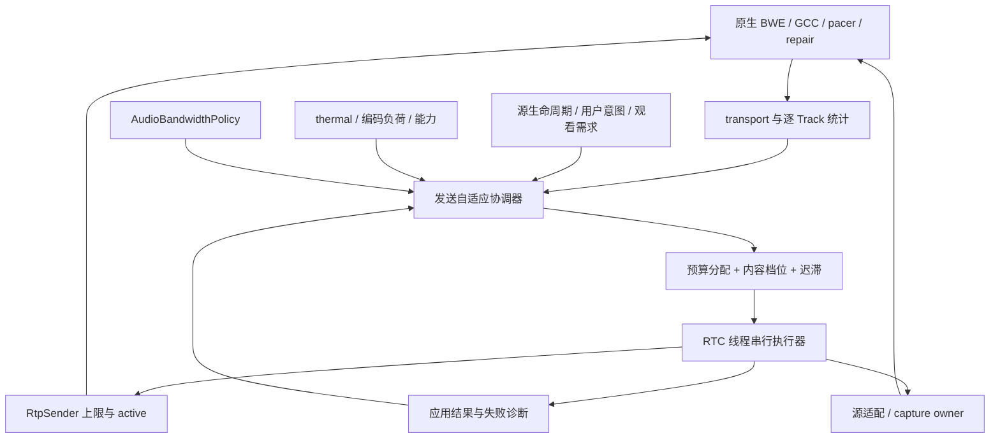

# 视频通话与屏幕共享参数自适应专项设计

## 1. 目的、状态与依据

把[视频参数自适应研究报告](../researchs/视频通话与屏幕共享场景下的视频参数自适应决策研究报告deep-research-report.md)转成 Zisee Android 可分步实施、可回退、可测量的发送端设计。本文是待评审方案，新增控制器、档位、阈值和实验均不代表当前 APK 已实现或真机验证通过。

目标是在同一通话中根据发送方向的网络能力、内容类型、设备负荷和观看需求，选择可持续的视频工作点。优先保证通话连续、音频可懂、主要目标清晰和交互低延迟，再提高分辨率。保持 1v1 P2P 优先和 TURN 回退，不引入 SFU、额外媒体连接或服务端转码。

关联约束：

- [视频体验基线](VIDEO_EXPERIENCE.md)：已有摄像头质量上限、原生拥塞控制和诊断。
- [屏幕共享实现](SCREEN_SHARE.md)与[M3 产品专项](../product/CALL_MULTITASKING.md)：共享方只发送屏幕与音频，暂停全部本机相机；纯语音时结束共享，不能自动重新捕获。
- [网络切换设计](NETWORK_HANDOVER.md)与[音频专项](AUDIO.md)：复用换网恢复、音频优先与有界摄像头探测。
- [AR 交互](../product/AR_INTERACTION.md)与[AR 框架](AR_FRAMEWORK.md)：不能破坏历史帧、几何和空间锚点一致性。

### 1.1 研究结论的采用方式

| 报告章节 / 结论 | Zisee 决策 | 实施阶段 |
| --- | --- | --- |
| 执行摘要、带宽估计与码率控制应分层 | 原生负责快速拥塞控制；应用负责慢速上限、内容取舍和跨 Track 分配 | V1 |
| 场景类型决定先牺牲什么 | 人像均衡、文字保分辨率、运动保帧率；均服从音频与设备保护 | V1/V2 |
| 网络分档、参数推荐 | 转为实验档位，使用扣除预留后的单 Track 预算，不照搬 BWE→分辨率表 | V2 |
| 软硬件与平台选择 | 保留现有协商/回退，先测实际编码路径；新 codec 仅能力验证后实验 | V4 |
| FEC、RTX 与 RTT 联合决策 | 先观测修复开销；不在 Java 层虚构动态 FEC 比例或重传 deadline 接口 | V0/V4 |
| 屏幕共享、帧差与 ROI | 首版用明确的内容模式和限帧；自动分类、变化区域和 ROI 分开验证 | V1/V3/V4 |
| 未解决问题、验证实验 | 用同源、同网络 trace 的 A/B，联合评价文字可读性、冻结、延迟和能耗 | 各阶段 |

报告中 headroom、带宽分档、RTT/loss 门限和缓冲毫秒值均为工程初值，不是标准保证。原报告含会话内引用标记，本文保留原文件并用相对链接追溯，不把这些标记复制为可访问文献。本文独立核对的外部接口依据列于第 13 节；上游 main 源码不能代替仓库锁定 AAR 的能力验证。

## 2. 当前实现与具体缺口

代码基线：`5381c97`；`minSdk=26`、`targetSdk=35`，`io.github.webrtc-sdk:android:144.7559.15`。以下为源码核对结果，未新增设备验证。

| 模块 | 当前行为 | 本专项需要补齐 |
| --- | --- | --- |
| [VideoQualityPolicy](../../android/app/src/main/java/com/lazydoglab/zisee/rtc/VideoQualityPolicy.kt) | ECONOMY 360p15/450 kbps、HD 720p30/4 Mbps、FULL_HD 1080p30/10 Mbps、FULL_HD_60 1080p60/12 Mbps 上限；热保护与连续证据；换网先回 ECONOMY | 按内容选择空间/时间档位；使用相对帧期限而非通用固定编码耗时；保留已有恢复语义 |
| [NativeRtcSession](../../android/app/src/main/java/com/lazydoglab/zisee/rtc/NativeRtcSession.kt) | `applyQuality` 使用 BALANCED，适配主摄与缩略图；共享和 AR 时跳过该路径 | 对每个有效发送源单独计划；单一参数写入 owner；不能把相机策略套到屏幕/AR |
| [MediaStatsSampler](../../android/app/src/main/java/com/lazydoglab/zisee/rtc/MediaStats.kt) | 聚合收发吞吐，选择一路视频编码统计；已有区间差分和远端上行丢包 | transport 与每条 Track 分层；屏幕映射、反馈新鲜度、修复开销、分源诊断 |
| [AudioBandwidthPolicy](../../android/app/src/main/java/com/lazydoglab/zisee/rtc/audio/AudioBandwidthPolicy.kt) | ALL_VIDEO / PRIMARY_ONLY / AUDIO_ONLY / VIDEO_PROBE；96 kbps 语音保护门限、8 s 换网估计宽限和 4 s 探测 | 当前执行只遍历前后摄，必须覆盖屏幕退出；96 kbps 门限不能直接当成实际音频消耗 |
| [ScreenShareSession](../../android/app/src/main/java/com/lazydoglab/zisee/screen/ScreenShareSession.kt) | Surface 纹理直达 `VideoSource(true)`；`video_screen` 预分配；共享方关闭相机 | 独立 sender 上限、内容策略和采集限帧；分清共享活动与实际远端可见 |
| [ScreenCaptureSize](../../android/app/src/main/java/com/lazydoglab/zisee/screen/ScreenCaptureSize.kt) / [AndroidScreenProjection](../../android/app/src/main/java/com/lazydoglab/zisee/screen/AndroidScreenProjection.kt) | 初始采集长边 1600、16 对齐；系统内容 resize 通过 controller 更新已有 VirtualDisplay | 将系统输入尺寸与输出预算分开；所有 resize 入口统一限幅，不能仅凭初始上限宣称后续始终受限 |

已有 `VideoQualityPolicyTest`、`MediaStatsSamplerTest`、`AudioPolicyTest`、`ScreenShareControllerTest` 和 `ScreenCaptureSizeTest` 是回归基础。历史视频文档仍有三档描述，实际代码已有 60 fps 条件档；路线图也有较早的共享组合描述，本专项按最新 M3 专项和代码的“共享方无相机”约束设计，不扩大并发采集范围。

## 3. 范围与不变量

首轮先补全统计、屏幕质量与音频保护，再统一摄像头和屏幕决策。新策略以本地开关分阶段启用；默认不改 codec、SDP、现有 S1/K1 控制消息、ICE 策略和服务端。

必须满足：

1. 各方向独立决策；本机下行丢包不作为本机上行丢包，host/relay/Wi-Fi 标签不能证明容量。
2. 音频保护、用户停止、权限撤销、锁屏和源生命周期优先于质量升级。策略无权创建授权或复活源。
3. 每个 transport 只分配一次共享预算；每条 Track 只分配一次视频预算；暂停源不占活动视频份额。
4. 不强制高最低码率，不逐秒按 BWE 重写全部 sender 参数；native 仍可在上限内降码率、尺寸和帧率。
5. 参数成功不等于真实高清：分别记录 requested、applied、observed；缺失统计保持 unknown。
6. 摄像头、屏幕、AR 保持独立源身份；质量切换不能改变空间标注帧身份或把 2D 坐标误当 3D。

不纳入首版：1440p/4K、屏幕 60 fps、屏幕与本机双摄并发、系统音频、SVC/simulcast、BBR 替换、任意 ROI/QP map、固定 jitter buffer、通话中自动 codec 重协商。这些分别需要独立证据与能力入口。

## 4. 控制结构与职责



以下名称为拟新增内部模型，不是已存在 API：

| 组件 | 职责 | owner / 约束 |
| --- | --- | --- |
| `AdaptationSnapshot` | 一次一致快照：transport、Track、能力、意图、语音保护、单调时间 | 复用每秒 stats loop，不再开第二个 getStats 轮询 |
| `VideoAdaptationPolicy` | 纯 Kotlin：快照 + 上次已应用状态 → `SendPlan` | 不调用 Android/WebRTC，可用虚拟时钟测试 |
| `SendPlan` / `TrackPlan` | 版本、会话/源代次、活动状态、内容类型、码率/FPS/尺寸上限、主因与限制集合 | 只包含数值与枚举，无 Surface/授权 Intent |
| `VideoParameterApplier` | 获取最新参数、执行差分、核对结果，回报 applied / rejected / stale | NativeRtcSession 的 RTC dispatcher 唯一写入者 |
| `ScreenOutputPolicy` | 根据原始内容比例与计划算输出尺寸、限帧 | 复用 ZiseeScreen owner；串行合并 resize，不能在主线程等待 |

迁移后 `applyQuality`、`thumbnail`、`applyAudioBandwidth` 的参数修改均汇入同一执行器；迁移前仍使用旧实现，禁止两个控制器同时写同一 sender。旧 UI 的 `MediaStats` 摘要保留兼容，新增逐源快照供策略使用，不能直接删除原有诊断。

仲裁顺序为：源终止/隐私 → 音频保护 → 严重热状态/执行失败 → 换网恢复 → 总预算 → Track 优先级 → 内容档位 → 有余量升级。内容保分辨率仅是偏好，不覆盖前面的硬约束。

## 5. 统计契约与预算口径

### 5.1 快照与新鲜度

每秒采样一次。键为 `(callGeneration, sourceGeneration, statsId/SSRC)`；换 Track、换 SSRC、计数回退、时间倒退或采样间隔超过 3 s 时重置差分与连续证据。transport 还携带 `routeGeneration`，换路由清除旧 BWE、RTT 基线和远端反馈证据。

| 数据 | 来源与计算 | 缺失行为 |
| --- | --- | --- |
| 上行 BWE、候选类型、RTT | selected transport/candidate pair；bps、ms 统一转换 | 不从实际低发送率反推低容量；不把 RTT=0 当成测量值 |
| 逐源编码尺寸/FPS/codec/implementation | outbound-rtp 关联 sender、mediaSourceId、Track 身份 | 多路无法唯一关联时标 unknown，禁止取第一路去调另一源 |
| 发送方向 loss | 对应 outbound 的 remote-inbound；报告时间只在更新时刷新 | 超过 3 s 视为过期；重复报告不延长健康窗口 |
| 编码耗时 | `1000 × ΔtotalEncodeTime / ΔframesEncoded`，ms/frame | 分母为零或重置时 unknown；静态屏幕无新帧不判编码失败 |
| 发送延迟 | `1000 × ΔtotalPacketSendDelay / ΔpacketsSent` | 仅是区间每包平均发送延迟，不是当前队列长度或端到端延迟 |
| 接收质量 | 每源 freeze、decode/drop、jitter buffer 增量 | 仅诊断本机接收；未新增对端遥测协议前不驱动本机上行 |
| RTX/FEC、负载与帧突发 | 按实际 AAR 暴露字段建立能力表，计数取差分 | unknown 不等于修复开销为零；不把巨大帧直接判成动态内容 |
| 设备负荷 | thermal、编码耗时/目标帧间隔、native CPU limitation | API 26–28 thermal 未知；NONE 也不保证无发热问题 |

不能由 1 s 采样宣称实现报告建议的 0.3 s 应用降档；亚秒拥塞响应属于 native。累计编码时间平均值也不能用作编码 P95/P99；尾延迟须单独埋点或测试工具测量。

### 5.2 分清线路负荷、媒体预算和应用上限

研究中的“总发送率低于安全 BWE”是目标约束，不是 Java sender 参数能精确保证的线路整形。`availableOutgoingBitrate` 的定义、实际 AAR 实现与 `maxBitrateBps` 的计量边界须在 V0 核对；不能把应用负载估计冒充运营商线路容量。

规划统一采用有效媒体负载 bps；线路层观测另行记录 RTP header/padding、UDP/IP/TURN/DTLS/SCTP 等可测开销。若 BWE 口径已排除某开销，不再减一次；若无法确认计数是否含修复流，不启用精细预算模式，先维持旧摄像头上限并使用屏幕保守档和音频保护。

在确认 BWE 是共享媒体估计、尚未扣除以下媒体份额的模式中，实验预算为：

```text
B = 有效且新鲜的 transport 媒体 BWE
safe = h × B
videoPool = max(0, safe - audioReserve - repairReserve - dataReserve)
sum(trackVideoCeiling) <= videoPool
trackVideoCeiling = min(分配份额, 内容档位上限, 设备上限, 观看需求上限)
```

`h` 起测为稳定 0.90、持续受限 0.80；更低取值由 trace 验证。它用于估计误差余量；修复预留单独包含同口径的 RTX/FEC，避免既按比例扣一次又按字节重复扣。建议 `audioReserve` 初始 64 kbps（现有 Opus 32 kbps 上限之外的规划余量），`dataReserve` 初始 16 kbps；这些是预算预留，不修改 Opus 参数，也不等于 AudioBandwidthPolicy 的 96 kbps 保护门限。修复预留先用同口径实测滑动窗口高值；缺失时以 B 的 10% 起测并标注 estimated。

例：确认口径后，B=1 Mbps、h=0.80，音频 64 kbps、修复 100 kbps、控制数据 16 kbps，视频池为 620 kbps。单摄可试 360p15；文字共享可试长边 1280/5 fps。两者均不承诺达到可读性目标，翻页突发必须由 native pacing/码控吸收。没有第二路活动视频时不得重复扣“辅摄预算”。

普通预算下降须连续 2 s；档内 ceiling 改变不足 15% 时不写参数。明显危险可立即降上限，升上限走第 7 节窗口。应用上限会影响 BWE 探测，不能把上述公式每秒机械闭环：恢复探测期间暂时抬高一级应用上限，让 native 在自己的安全目标内探测，仍保留音频、设备和产品上限；诊断标记 `PROBE`，不得注入应用填充流或宣称该上限等于实际发送率。

### 5.3 多 Track 分配

共享方只有 `video_screen` 参与视频池；观看方自身相机使用其独立上行池。Dual View 先为有效主画面分配，辅摄不超过视频池 20% 且不超过 450 kbps，主摄获得其余份额；主摄达到内容上限后的闲置预算不必用满。低于辅摄最小可用工作点时暂停辅摄，资源不足进一步降主摄，最后语音保护。

优先复用现有 `remoteView` 的 LARGE/SMALL；缺失时沿用已有默认主源，不假设对端 PiP 尺寸。远端观看需求只能降低已授权源成本，不能远程开启源。主辅切换立即重分预算，先压低旧主源再提高新主源；不能出现两路各拿完整池的过渡。共享文字不直接套用摄像头缩略图 360p 上限，V1 在无屏幕专属观看反馈时保持文字策略。

## 6. 内容模式与实验工作点

### 6.1 模式和降级顺序

| 模式 | 入口 / 默认 | 原生偏好目标 | 持续资源不足时的顺序 |
| --- | --- | --- | --- |
| CameraBalanced | 普通前摄、单后摄默认 | BALANCED | 减码率上限 → 降空间档 → 30→24→15 fps → 暂停 |
| CameraMotion | 后续已确认高动作需求 | MAINTAIN_FRAMERATE | 先空间档，再帧率；60→30 最先降 |
| ScreenText | 共享默认；产品“文字清晰” | MAINTAIN_RESOLUTION | 10→5→3 fps → 缩小一档 → 1 fps 保底 → 不可用则结束共享 |
| ScreenMotion | 用户选择“动态流畅” | MAINTAIN_FRAMERATE | 30 fps 下先缩小一档 → 15 fps → 不可用则结束共享 |
| ScreenBalanced | V3 确认连续滚动后 | BALANCED | 在文字清晰与滚动连续之间选择经过实验的中间档 |
| ArScene | AR owner 提供专属约束 | 仅使用已验证的 AR 适配 | 首轮保持采集几何，仅收紧码率；不足交回 AR owner 降负载/结束 |

界面最多提供“文字清晰 / 动态流畅”语义选择，不要求用户填写 codec/码率。V1 默认 ScreenText，切模式不重启共享、不弹系统授权；手动选择优先于未来自动分类。模式偏好不承诺固定清晰度；网络受限提示原因。编码器不支持目标偏好时保留可用策略并标注降级，不挂断。

### 6.2 摄像头候选档

以下为 V2 A/B 候选，不直接替换现有 4/10/12 Mbps 上限。码率是单 Track 应用上限的实验范围，不是最低码率；选择表内不超过分配预算的值，预算低于范围下界时选更低档。空间尺寸为 16:9 示例，真实采集保留源比例并遵守设备能力。

| 档 | 示例尺寸 / fps | 视频上限起测范围 | 价值 |
| --- | --- | --- | --- |
| C0 | 320×180 / 10–15 | 150–350 kbps | 弱网保连续性；低于可用工作点交给语音保护 |
| C1 | 640×360 / 15–24 | 400–800 kbps | 普通弱网 |
| C2 | 960×540 或 1280×720 / 24–30 | 0.9–2.2 Mbps | 日常通话 |
| C3 | 1920×1080 / 30 | 2.5–4 Mbps | 主画面细节、经过能力验证 |
| C4 | 1280×720 或 1920×1080 / 60 | 4–6 Mbps | 仅运动需求、设备余量与实测收益同时成立 |

V1 保持既有能力优先摄像头启动；V2 将“720p30 保守启动”与“现有支持时 1080p30 启动”比较首帧、清晰恢复与突发。未获得数据前不改变默认。60 fps 的现有能力检查与 12 ms 编码门限作为基线保留，V2 不因 BWE 大就自动开启。

### 6.3 屏幕候选档与尺寸

屏幕使用长边、比例与总像素数，不把竖屏 1600×720 叫作 1080p。V1 上限仍为长边 1600，不增加源像素；V2 可在真机验证后试长边 1920。

| 模式 / 档 | 长边上限 | fps 上限 | 单 Track 码率上限起测范围 |
| --- | --- | --- | --- |
| Text normal | 1600 | 10 | 1.0–2.0 Mbps |
| Text constrained | 1600；不满足可读性/刷新期限后降 1280 | 5 / 3 | 400–1000 kbps |
| Text last resort | 1280 | 1–3 | 150–400 kbps |
| Motion normal | 1280 | 30 | 1.2–2.5 Mbps |
| Motion constrained | 960 | 15 | 500–1000 kbps |

静态低发送率不触发降档；要观察内容发生变化后是否能及时送达。仅靠保持高分辨率却每次翻页冻结数秒不算成功。连续无法形成可用画面时提示“网络不足，已结束共享，语音继续”；恢复后显示重新共享入口，必须重新授权。暂时换网不能因冷启动 BWE 的一个低样本直接结束共享。

输出尺寸始终从原始内容宽高计算一次等比缩放，再按能力对齐，防止对已经缩小的结果重复缩放。区分 `contentSize`、`captureSize`、`encodedSize`、显示 FIT 几何；系统 resize 与策略 resize 合并为同一 owner 上的最新请求。16 对齐是现有保守选择，不是所有 codec 通用硬性要求；需检查舍入后的比例、非零边长、长边和像素上限，避免裁掉文字。

V1 优先使用 sender/VideoSource 限制实际发送与编码帧率；这不保证减少系统合成或 Surface 回调成本。V3 才评估采集入口按源时间戳限帧、变化驱动提交。Texture 管线不转 Bitmap、不逐帧 CPU readback；限帧时立即归还帧引用。尺寸变更复用当前 VirtualDisplay，不再次消费授权；失败保留最后可用尺寸，无法继续则结束共享并释放。

普通翻页、光标移动、参数上限变化都不主动请求关键帧。首帧、真实解码恢复和编码尺寸切换依原生机制处理；任何后续主动 refresh 必须去重并测量突发，不循环 PLI 或把重复旧帧标成新内容。

## 7. 状态、迟滞与恢复

质量控制状态与源生命周期分开。每源质量状态为 `STARTUP → STABLE ↔ CONSTRAINED → RECOVERING → STABLE`，摄像头恢复可临时进入 `PROBING`；执行失败进入 `FALLBACK`。已终止源从计划集合移除，不能通过 RECOVERING 回到活动状态。

以下时间均为拟定初值，V1 复用既有音频保护时间参数，V2 才迁移摄像头普通切档：

| 事件 | 动作与时序 |
| --- | --- |
| 用户停止/权限撤销/源失效 | 立即取消该源计划与待执行任务，按既有 owner 释放 |
| AUDIO_ONLY | 立即停所有视频发送；相机走现有有界恢复，屏幕调用正常 stop/释放且不自动恢复；共享结束不得立刻恢复相机抢占音频 |
| severe thermal 或更高 | 下次事件处理立即限制负荷，不等普通窗口；屏幕先到低 fps，仍过载则停止；不能经 thermal 分支升级低档 |
| native CPU limitation，或编码平均耗时超过目标帧间隔 70% 且伴随持续掉帧 | 连续 2 s 降一档；单独耗时升高先阻止升级；不得把 60 fps 和 5 fps 用同一 40 ms 门限 |
| 视频池不足、发送延迟 >60 ms/包且连续上升，或新鲜上行 loss ≥5% | 连续 2 s 收紧上限/降档；高 RTT 单独出现只阻止激进升级，不反复降到最低 |
| 普通升级 | 新鲜 BWE 足以使下一档上限 ≤可分视频池的 80%，loss <2%、发送延迟 ≤30 ms/包、无 CPU limitation、thermal < moderate，连续 8 s；缺失条件不走普通升级 |
| 热/编码恢复 | 连续 15 s 有余量后只升一级；未知 thermal 时需有编码余量证据，不进入 60 fps 快速路径 |
| 格式冷却 | 普通尺寸/FPS 切换间隔至少 5 s；严重恶化、停止和音频保护可绕过；普通升档一次一级 |
| 遥测缺失 | 保留已应用档，打断升级窗口；仍处理停止/热事件；摄像头按已有有界探测避免永久低清 |

`routeGeneration` 变化后进入恢复：摄像头沿用当前 ECONOMY 起步、30 s 原质量恢复窗口和至少 2 s 一级的恢复语义；不得恢复到新设备/热状态不允许的档位。音频策略保留现有 8 s 估计宽限，真实新鲜音频丢包仍可触发保护。屏幕维持既有投影与内容模式，先收紧 fps/码率；没有断链/拥塞实证时不把历史低 BWE 当长期容量。

应用受限的摄像头恢复探测复用 AudioBandwidthPolicy 的 4 s 探测与失败后 3–30 s 有界退避，统一协调，不能并行跑两个探测定时器。普通低清恢复只放宽一个档位 ceiling，由 native 决定实际发送；健康证据缺失时不宣称容量已恢复。屏幕进入 AUDIO_ONLY 后投影已经结束，VIDEO_PROBE 不得重启屏幕；只有仍有效的已授权相机意图可参与探测，不能借停止共享暗中开相机。

## 8. 执行、失败与生命周期

每次计划带 `(callGeneration, sourceGeneration, routeGeneration, planRevision)`，落地前再次核对。主辅切换、换网、用户停止或系统回调使旧计划失效；同源只排队最新计划。结束通话先取消采样/计划再释放资源，迟到 stats 或 resize completion 不能访问已 dispose 的 sender/source。

应用顺序：先降低/禁用需要让出预算的 sender，确认成功后再提高其它 sender；每次从 sender 重新取参数，保留未管理字段，`minBitrateBps=null`。不要假设多 sender 更新原子化。降额失败时不升级另一条 Track，以已应用状态重新预算；有界尝试安全停发，保证音频保护优先。

成功应用 sender 参数后再按需更新源输出；采集重配由相应 owner 执行并返回结果。部分成功记录 partial：以实际仍生效的更保守约束运行，不把完整计划标成成功；回滚也须检查结果。普通参数拒绝只停用该 sender 的实验调参并回到最后可用参数/原生控制；不能因此停掉所有源或挂断。若涉及必须停止发布的安全条件，参数拒绝时改用 Track 禁用与源 owner 清理兜底。

AR 首轮不调用通用 `changeCaptureFormat`、任意裁切或普通降分辨率路径。后续若改变编码几何，必须同时验证帧身份、历史 intrinsics、完整图像坐标与显示映射；无法保证就交回 AR owner 正常结束现场、清除失效空间交互并保留语音。不得用当前 Pose 补历史帧。

进入后台、PiP、锁屏、共享结束等沿用活动通话产品规则。自适应只收紧已允许发送源，不改变权限流程或相机恢复意图。停止共享后的画面标注清理由原有协作 owner 完成。

## 9. Codec、修复与缓冲的实施边界

| 能力 | 首轮策略 | 后续开放条件 |
| --- | --- | --- |
| codec 与软硬编 | 保持 DefaultVideoEncoderFactory 和既有协商；不能由 H.264 名称推断硬编 | 两端 SDP 能力、实际编码器、分辨率/FPS 组合、功耗及回退验证；AV1 硬编等按设备检测 |
| 降级偏好 | 检查锁定 AAR 的 RtpParameters 能力，按源设置目标偏好 | Web contentHint 的字符串语义不等于 Android API；不支持时显式 fallback |
| FEC/RTX | native 管理，统计实际协商与修复代价 | 自定义 native 接口与同预算 A/B；低 RTT+loss 和高 RTT+loss 分开实验 |
| NACK/PLI | 保留原生反馈；PLI 请求恢复图像，不是冗余纠错数据 | 修复要按播放期限评估；不能简单规定 RTT 超过 200 ms 就禁用 RTX |
| CBR/capped VBR/QP/VBV | 不把 maxBitrate 当 CBR 或硬峰值保证，不修改原生默认 rate control | 编码器专属适配、拒绝回退、关键帧与队列实测；无受控峰值不启用自由 VBR |
| jitter buffer | 保留原生自适应与音视频同步 | 报告中的 40–250 ms 仅用于独立实验，不能当 Java 层统一可设置值 |
| ROI / dirty region / 裁剪 | 三种能力分开；首版不引入内容读取权限或重分析管线 | 本地有界成本、总预算内分配、屏幕可读性收益与隐私审查 |

codec 候选预选在通话建立时完成；动态切换属于 V4，需要双方协调、失败回退、关键帧控制与超时。Android MediaCodec 能枚举某 codec 不表示当前 WebRTC factory 能发送它，更不证明双编码器并发可持续。

## 10. 可观测性与用户反馈

每次有效决策记录：策略版本、匿名通话关联号、源类型/代次、路由代次、旧/新档位、主因和限制集合、BWE 及 freshness、预算份额、内容模式、热状态、编码负荷、requested/applied/rejected、实际编码尺寸/FPS/码率。原因枚举至少含 AUDIO、THERMAL、ENCODER、BANDWIDTH、QUEUE、CONTENT、VIEW、RECOVERY、STALE_STATS、PARAM_REJECTED。

每秒快照留在有界内存环；持久日志按状态变化和周期摘要输出，不能逐秒倾倒全部 stats。禁止日志包含屏幕文字、画面、SDP、候选地址、授权 Intent、Token。自动内容分析只输出本地枚举/数值，不上传截图；屏幕 OCR 只对测试素材离线进行。

界面显示真实结果和可行动原因，例如“已降低流畅度以保持文字清晰”“设备温度较高”“共享已结束，语音继续”。不要用计划的 1080p 替代实际编码尺寸，也不要把静态画面无变化显示为网络卡顿。发生断链或共享结束时取消实时标记状态，不能让最后一帧冒充当前场景。

## 11. 验证矩阵与发布门槛

### 11.1 自动验证

在原测试类基础上增加行为测试，具体实现阶段再编写：

- 统计：三路 sender 映射、SSRC/源代次变化、重复远端报告、过期 BWE、负增量、零帧、单位与 RTX/FEC 去重；无法归属时不误调其它 Track。
- 决策：预算守恒、零视频预算、双摄交换主源、内容模式不同降级顺序、缺失统计与虚拟时钟、快降慢升、60→30、热恢复不越能力上限。
- 生命周期：屏幕 AUDIO_ONLY 只 stop 一次，恢复不调用投影 factory；用户关闭后探测不复活；换网低样本与真实音频 loss 分开处理。
- 执行：sender 拒绝、部分成功、降额失败不加额、source resize 失败、旧计划与迟到回调失效、关闭前取消任务。
- 几何：横/竖/超长屏、16 对齐、系统 resize 和策略 resize 交错、原始比例保持、AR 路径不误走普通裁切。

Android 实施完成后执行 `:app:testDebugUnitTest :app:assembleDebug :app:lintDebug`；涉及 native 参数和采集时增加 androidTest 与设备冒烟。JVM fake 不证明真实屏幕出帧、硬编能力、发热或网络恢复。

### 11.2 双真机与 A/B

固定两端构建 commit、策略版本、设备/系统、codec implementation、源素材、测试时长、网络 trace 和随机种子。每个基准格至少 5 个种子；首帧/换网每方向至少 20 次，成功率和失败样本单列，报告 p50/p95/p99 与置信区间；样本不足的尾部分位数标注不可稳定估计。使用分阶段矩阵，避免一次全笛卡尔积。

| 维度 | 基准与压力集 |
| --- | --- |
| 内容 | 人像低/高动作、后摄细节、双摄主辅切换；IDE/网页/表格小字、PPT 每 2–10 s 翻页、连续滚动、30 fps 视频 |
| 带宽 | 150k、300k、750k、1.5M、3M、5M、8M；5M→500k→3M，每阶段 30 s |
| 网络 | RTT 20/80/150/300/500 ms；随机 loss 0/1/3/5/10%；同均值 burst loss；jitter 0/30/60/100 ms；大小队列；单独限上行/下行 |
| 路径 | P2P、强制连通性受限的 TURN UDP/TCP/TLS；Wi-Fi↔蜂窝及 Wi-Fi A→B；不能靠候选名证明实际路径 |
| 设备 | 低/中/高端，API 26 基线、29+ thermal、34/35 MediaProjection；支持/不支持双摄与硬编组合 |
| 生命周期 | 全屏/PiP/后台、横竖旋转、锁屏、系统停止、授权取消、共享→相机恢复、30/60 分钟持续负载 |

比较现有策略与新策略，主要实验为：文字同码率高分辨率低 fps vs 低分辨率高 fps；人像保帧率 vs 保尺寸；原上限 vs 新预算；固定文本模式 vs 自动分类。Codec、FEC、rate control 对照放在 V4，不混在一次实验中改变所有变量。

指标至少包括音频 concealment/中断、视频冻结与帧间隔、首帧、降档/恢复耗时、实际编码/接收尺寸与 FPS、发送延迟、修复开销、温度/功耗。离线素材额外做 SSIM/VMAF 和文字识别/主观可读性；变化画面恢复与光标延迟用外部同步拍摄测量，不能使用 RTT/2 推算端到端延迟。静态屏幕按已知内容变化事件评估更新期限，不能仅靠低 FPS 或 freeze counter 判坏。

### 11.3 首版门槛（拟定目标，非测量成绩）

| 项目 | 发布门槛 |
| --- | --- |
| 正确性 | 上述预算/方向/生命周期自动测试通过；无自动恢复屏幕、用户停源后复活、旧计划写入或源归属错误 |
| 音频保护 | 相同 trace 下新策略不能使音频中断/隐藏样本比例出现可重复退化；屏幕退出后资源完成释放 |
| 下降响应 | 1 s 采样下，持续条件成立后应用降额不晚于 3 s；native 响应独立测量 |
| 抖动 | 固定容量阈值附近 60 s 内普通空间档切换 ≤2 次，紧急保护另计；恢复不永久停留最低档 |
| 文本 | 1.5 Mbps、RTT 80 ms、loss 1% 的固定素材上，文字识别率与主观可读性不低于基线；翻页到可读画面 P95 ≤1 s，失败也记录 |
| 运动 / 延迟 | 同 trace 下冻结率和端到端延迟不得出现可重复退化；不能以提高 VMAF 抵消明显冻结 |
| 稳定性 | 双真机持续 30/60 分钟无崩溃、持续积帧、资源泄漏；记录峰值和稳态热/功耗，不能仅凭目测宣称节能 |

未通过则保留实验开关关闭，先收集原因与 trace；对不可达门槛记录设备/网络边界，经评审调整目标，不能删掉失败样本。

## 12. 分步实施与回退

| 阶段 | 独立交付与建议 commit 意图 | 退出条件 |
| --- | --- | --- |
| V0：观测 | 扩展逐 Track stats、新鲜度/口径/能力表；`feat: add per-track adaptation telemetry` | 统计单测 + 实际 AAR 字段核验 + 双真机基线；只观察不改发送 |
| V1：M3 补齐 | 屏幕独立参数、Text/Motion、音频保护终止共享、统一 resize 边界；`feat: adapt screen sharing quality` | 生命周期/执行测试、构建/lint、两端共享真机矩阵；默认摄像头行为保持 |
| V2：M6 统一 | 唯一执行器、预算分配、内容档位、迟滞与有界探测；`feat: coordinate video adaptation budgets` | 策略影子运行比对，再开实验；通过同 trace A/B 后决定默认 |
| V3：内容与功耗 | 可选本地变化分类/限帧、观看需求扩展 | 不做逐帧 CPU 读回；误判/切换频率和实际耗电有对比收益 |
| V4：编码实验 | codec、FEC/RTX、ROI/CBR/CVBR 独立实验，每项单独提交 | 能力/互通与回退验证；每项均有 QoE 与成本证据 |

V3 自动模式初始可试：持续运动证据 2 s 才转 Motion，连续静态 8 s 才回 Text，切换至少间隔 5 s；一次翻页不切 Motion。帧变化证据必须来自有界、已测成本的实现，不能只凭码率高低推断文本/运动。首版可在没有分类器的情况下完整运行。

开关按 `telemetry`、`screenPolicy`、`coordinatedPolicy`、`experimentalCodec` 分离并带策略版本。关闭 coordinatedPolicy 后停止新控制器，串行恢复最后有效的旧摄像头策略和保守屏幕上限；不能让旧低上限残留或双写。音频保护、用户停止和资源清理不随实验开关关闭。回退无需服务端变更，不自动重新授权，不重写 Git 历史。

若后续增加屏幕观看需求或远端质量反馈，先单独制定版本化协议、大小/频率限制、旧客户端忽略语义，再接入现有控制通道；本设计不预留未经定义的线路消息。

### 12.1 当前交付：V0 统计第一步

已接入 `MediaStats.outboundVideo`：按明确的源身份提供前摄、后摄、屏幕独立统计；重复/冲突映射不进入逐源集合，多路摘要不再回退到任意视频。RTC 摘要按实际主摄或屏幕选择，观看共享时选远端屏幕。差分拒绝 SSRC/源身份变化、计数回退及超过 3 s 的采样间隙；视频远端反馈按报告时间过期，换路由后旧报告不继续提供健康证据。重传码率作为发送负载子集展示，不再次累加。

这一交付尚不等于 V0 全部退出：实际 AAR 的跨设备字段覆盖、FEC/BWE 计量边界和双真机基线仍待验证；没有启用精细预算或新摄像头档位。

### 12.2 当前交付：V1 屏幕质量

`ScreenQualityPolicy` 已实现文字/动态两条独立档位链：Text 档 1600×10fps/2.0→1600×5fps/1.0→1280×3fps/0.4 Mbps，Motion 档 1280×30fps/2.5→960×15fps/1 Mbps；`current`/`mode` 只在同一档位链内升降，不跨链比较序号。降档区分严重（热 ≥3 或编码器过载，立即生效）与普通（带宽/丢包/发送延迟连续 2 s）；升档要求连续 15 s 健康证据，证据中断（采样间隙 >3 s 或一次不新鲜/未知样本）后升档窗口从中断点之后的样本重新计时，不沿用中断前已经过的时长。普通降档与升档之间追加至少 5 s 的档位切换冷却，严重条件与模式切换绕过冷却。`NativeRtcSession.setScreenContentMode` 在 RTC 执行器上切换模式，不重启投影、不重新申请系统同意；新的一次共享总是从 Text 档开始，选择只在本次共享内有效。`ScreenShareState` 新增 `contentSize`（start/resize 传入的原始尺寸），`applyScreenQuality` 始终从 `contentSize` 重新按档位上限缩放，不对已经缩放过的 `size` 二次缩放；只在档位或 `contentSize` 实际变化时才重写 sender 参数和源输出格式，可见性变化等其它状态更新不再重复下发。纯语音结束共享（`ScreenShareReason.AUDIO_ONLY`）在 `CallViewModel` 侧已接入通知文案"网络不足，已结束共享，语音继续"，通过既有 `arNotice` 通道展示,只在从非终止状态进入该终止状态时触发一次。每次档位实际变化记录 `AppEvent.RTC_QUALITY_CHANGED`，内容形如 `screen:TEXT_CONSTRAINED:BANDWIDTH`（原因枚举取 THERMAL/ENCODER/BANDWIDTH/QUEUE/LOSS/RECOVERY/MODE 之一），不含画面、SDP 或地址信息。

尚未验证：以上全部时序常数（2 s/5 s/15 s/3 s 中断阈值）只在 JVM fake 时钟下验证过分支，未在真机网络与内容素材上标定；`MAINTAIN_RESOLUTION`/`MAINTAIN_FRAMERATE` 是否被各设备编码器实际接受、降低屏幕 fps 是否确实降低编码负荷、连续翻页/滚动下降档节奏是否符合可读性目标，均无真机数据支持；「文字清晰 / 动态流畅」UI 只做过 Compose 层走查，未做真机可用性或无障碍验证。

### 12.3 当前交付：V2 第一步（摄像头策略开关）

新增 `CameraAdaptationPolicy`（纯 Kotlin，无 Android/WebRTC 依赖）实现 §5.2 预算、§5.3 双 Track 分配与 §6.2/§7 档位迟滞，由三态开关 `VideoAdaptationMode { OFF, SHADOW, ACTIVE }` 挑选生效路径；旧 `VideoQualityPolicy`/`applyQuality`/`thumbnail` 保持不变且默认生效。开关来自 `BuildConfig.VIDEO_ADAPTATION`（debug 为 `"ACTIVE"`，便于真机试用新策略；release 为 `"OFF"`），每次通话在 `NativeRtcSession` 构造时解析一次，本轮不支持运行期切换；未知或缺失值一律解析为 `OFF`。

三态语义：`OFF` 时新代码完全不运行（不调用 `cameraPolicy.update`，不订阅 `routeChanged`），与今天行为逐字节一致；`SHADOW` 时新策略每个 stats 采样都会运行并维护自己的迟滞状态，但只在 `CameraPlan.revision` 变化时记录一条 `AppEvent.RTC_ADAPTATION_PLAN` 诊断日志（同时带上旧策略当前档位便于比对），从不写 sender 参数或源输出格式；`ACTIVE` 时新执行器 `applyCameraPlan` 接管主/辅摄像头 sender 的 `maxBitrateBps`/`maxFramerate`/`adaptOutputFormat`（单摄仍调用 `changeCaptureFormat`），旧 `applyQuality`/`thumbnail` 在其入口直接提前返回，避免同一 sender 出现两个写者；`setParameters` 被拒绝时记录 `RTC_QUALITY_REJECTED`，本次通话永久回退到旧路径（镜像 `adaptationEnabled` 的语义）并立即用 `applyQuality(qualityPolicy.current)` 补一次旧路径写入。音频保护（`applyAudioBandwidth` 的 `active`/VIDEO_PROBE 上限）不受开关影响，新执行器在 `screenSharing`、`arLeaseId != null`、`VIDEO_PROBE`、`AUDIO_ONLY` 时整段跳过，与旧路径保持相同的跳过条件。`qualityPolicy.update` 在任何模式下都持续运行，为旧路径回退保留可用状态。

`CameraAdaptationPolicy` 内部：预算 `pool = max(0, h·B − 64kbps − 16kbps − repair)`，`h` 起测 0.90，一旦本次样本的降档原因是 BANDWIDTH/QUEUE 即转为 0.80 直至下一次升档；`repair` 优先取该 sender 在 `MediaStats.outboundVideo` 暴露的 `retransmittedKbps`，缺失时按 `B` 的 10% 估计并在 `CameraPlan.repairEstimated` 标注。双摄时辅摄份额为 `min(20% pool, 450kbps)`，低于 C0 下界（150kbps）时钉在下界并标记 `AUX_PAUSED`（不翻转 `encoding.active`，只把码率压到地板）。档位迟滞每次只移动一级：普通降档需连续 2 s，严重热（≥3）或 CPU limitation 立即降到 C0，编码耗时超过目标帧间隔 70% 持续 2 s 也降一级；普通升档需连续 8 s 的新鲜健康证据（下一档下界 ≤ 80% 视频池、丢包 <2%、发送延迟 ≤30 ms、`qualityLimitation=none`、热 <2），若上一次降档原因是 THERMAL/ENCODER 则升档窗口改为 15 s；档位切换之间另加 5 s 冷却，严重条件绕过；采样间隙 >3 s 或时钟回退只清空迟滞计时，不强制降档；`availableOutgoingKbps` 缺失时保持当前档并中断升档窗口，不推导任何新档位。`routeChanged` 落到 C1 并记录进入前的档位为 30 s 内、2 s 一级的恢复上限（镜像 `VideoQualityPolicy.routeChanged`），调用后立即反映到 `lastPlan`，不等下一次采样。档位起点沿用旧策略的开机选择（支持 1080p30 且 `preferFullHd` 时为 C3，否则 C2），因此 ACTIVE 不改变开局清晰度。同一档位内码率变化 <15% 不产生新 `CameraPlan`（`revision` 不递增），用于抑制过于频繁的参数写入。

尚未验证：本节全部时序常数与预算系数只在 JVM 假时钟单测下验证过分支（`CameraAdaptationPolicyTest`），未做真机联调；`availableOutgoingBitrate` 与 `retransmittedBytesSent` 的跨设备/跨 Android 版本可用性仍待 §13 的核实；ACTIVE 路径从未在真实设备上跑过，双摄场景下主辅同时调参的失败序列（`setParameters` 部分成功）尚无实机证据；SHADOW 日志尚未与真实通话的旧策略输出做过对比分析；开机瞬间的严重热直读快速通道（stats 采样失败但 `currentThermalStatus` 已达到 3）仍只保护旧路径，尚未把等效保护接入新执行器，留待下一步与真机验证一起处理。

## 13. 待验证问题与外部依据

V0/V1 必须回答：锁定 AAR 的 BWE 和 RTX/FEC 计数口径是什么；三路 sender 能否稳定映射；MAINTAIN_RESOLUTION 是否被各设备接受且达到预期；降低屏幕 FPS 是否确实降低编码负荷；系统 resize 是否始终保持输出边界。V2 再回答预算安全系数是否过度限制探测、摄像头新上限是否损失高细节价值、源切换是否引发明显关键帧突发。

以下资料于 2026-09-10 核对；用于接口语义与约束，不用于宣称本项目实测能力：

- [IETF RFC 8836](https://www.rfc-editor.org/rfc/rfc8836.html)：交互媒体拥塞与时延要求；本设计保留 native 快速控制。
- [WebRTC Android RtpParameters 源码](https://webrtc.googlesource.com/src/+/refs/heads/main/sdk/android/api/org/webrtc/RtpParameters.java)：发送参数与降级偏好；须对照本项目固定版本验证。
- [W3C WebRTC Stats](https://www.w3.org/TR/webrtc-stats/)：方向、累计计数、编码和延迟指标的语义参考；Android 不保证暴露全部字段。
- [Android MediaProjection 指南](https://developer.android.com/media/grow/media-projection)：一次性授权、VirtualDisplay、尺寸变化与清理边界。

## Changelog

### 1.3.0 - 2026-09-10

- 落地 V2 第一步：`CameraAdaptationPolicy`（预算、双 Track 分配、档位迟滞）与三态开关 `VideoAdaptationMode`（OFF/SHADOW/ACTIVE，debug 默认 ACTIVE，release 默认 OFF）；旧摄像头策略保持默认且行为不变，SHADOW 只记录诊断日志，ACTIVE 写 sender 参数并在拒绝时永久回退旧路径。全部时序常数与预算系数仅 JVM 假时钟验证，ACTIVE 未做真机测试。

### 1.2.0 - 2026-09-10

- 落地 V1 屏幕质量：Text/Motion 独立档位链、升降档迟滞与格式冷却、`contentSize`/`size` 分离、按需重应用、纯语音结束共享提示、屏幕质量变化诊断事件；时序常数与设备接受度仍待真机验证。

### 1.1.0 - 2026-09-10

- 落地逐源统计、确定性主源选择、视频反馈新鲜度与源身份变化差分保护；保留 V0 真机及统计口径验证门槛。

### 1.0.0 - 2026-09-10

- 根据研究报告建立摄像头/屏幕分场景自适应设计，记录代码基线与实际缺口。
- 定义统计口径、共享预算、单一执行器、迟滞/恢复、屏幕纯语音退出与 AR 边界。
- 给出实验工作点、分阶段实施、A/B 矩阵、发布门槛与回退策略。
