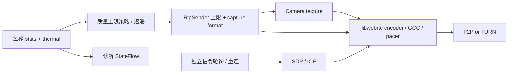

# 目标和边界

优先顺序：通话连续、音频可懂、主要目标清晰、低延迟，然后才是最高分辨率。这里的“最佳实践”是有证据、可测量、可降级的工程基线，不承诺一种参数适合所有 OEM、网络或场景。

本专项落实当前 1v1 单摄视频的质量控制、可观测性和媒体／信令隔离；双摄、屏幕共享、AR 在此基线上扩展独立 Track，不在本次引入。P2P 优先，TURN 参与正常 ICE 竞争作为连通性回退，不通过延迟获取 relay 候选假装节省连接时间。

## 验收目标（目标，不是已测成绩）

| 场景 | 验收目标 | 测量方式 |
|---|---|---|
| 已登录、前台、权限已授予、正常网络 | 接听到远端首帧 P50 ≤ 2 s、P95 ≤ 5 s | 每网络组合至少 20 次，冷启动单列 |
| 同城正常网络 | 端到端画面延迟 P50 ≤ 200 ms、P95 ≤ 350 ms | 同一外部相机拍摄现场计时器与接收屏幕，不能用 RTT/2 替代 |
| 可用带宽 ≥ 3.5 Mbps、设备支持 | 允许 1080p30 上限；实际发送／接收分辨率必须可查 | 双端 RTP stats + 真机编码器／温度记录 |
| 常规通话 | 支持 1080p30 的摄像头优先以 FULL_HD 上限启动，否则 720p30；限制下降时先保声音和连续性 | 双端 30 分钟会话，无崩溃、持续积帧或资源泄漏 |
| 带宽 4 Mbps → 400 kbps → 4 Mbps | Native 拥塞控制立即响应；应用避免反复切档、恢复有迟滞 | 每档 30 s，记录码率、发送延迟、卡顿、升降档原因 |
| 过热 | severe 及以上主动降低视频负载，恢复后缓慢升档 | 真机热状态与编码耗时；模拟热状态仅验证逻辑 |

# 依据和取舍

1. [RFC 8836](https://www.rfc-editor.org/rfc/rfc8836.html) 要求交互媒体适应拥塞、避免排队拖长实时延迟。保留 libwebrtc 的拥塞控制、pacer、重传和音视频同步，不另造逐秒追赶估计带宽的码率控制器，不硬设高最低码率。
2. [WebRTC Trickle ICE](https://webrtc.org/getting-started/peer-connections) 支持候选发现即交换。现有 media.ice 已去掉 gathering COMPLETE 的 20 秒等待；必须先升级服务端。保留晚到 TURN 候选。
3. [原生 RtpParameters](https://webrtc.googlesource.com/src/+/refs/heads/main/sdk/android/api/org/webrtc/RtpParameters.java) 支持 maxBitrateBps、maxFramerate 和 degradationPreference。应用设置可持续的上限和 BALANCED，native 决定上限内实际码率／分辨率／帧率。每次重新 getParameters，检查 setParameters 结果，拒绝时保留原生策略并记录，不能因此挂断。
4. [默认编码器工厂](https://webrtc.googlesource.com/src/+/refs/heads/main/sdk/android/api/org/webrtc/DefaultVideoEncoderFactory.java) 包含硬件／软件组合。保持设备支持的 codec 协商与软件回退，不硬改 SDP 强制 H.264/AV1，不把 codec 名称当作硬编证明。实际 encoderImplementation 和 powerEfficientEncoder 用于诊断。
5. [W3C stats](https://www.w3.org/TR/webrtc-stats/) 区分发送、接收和远端反馈。不能用本端接收丢包推断本端上行；累计编码时间、发送延迟、jitter buffer 必须取区间增量／帧或包数量，缺失值是未知，不是零。所有差分需处理计数重置、SSRC 变化和无效采样。
6. [Android PowerManager](https://developer.android.com/reference/android/os/PowerManager#getCurrentThermalStatus()) 的 thermal status 从 API 29 可用；更低版本为未知。[Thermal API 指南](https://developer.android.com/games/optimize/adpf/thermal) 说明 OEM 可能不报告真实状态，因此结合编码耗时和 native CPU limitation，不能以 NONE 宣称设备没有过热。

# 实现结构

单次 NativeRtcSession 持有 RTC executor、采集、sender、统计循环和 EGL；释放前取消统计，不让迟到 callback 修改下一次通话。统计超时只记录采样缺失，不结束媒体。信令往返不控制统计频率；连接状态独立通过 Flow 处理。

## 质量上限

| 档位 | 采集目标 | 视频码率上限 | 用途 |
|---|---|---|---|
| ECONOMY | 640×360、15 fps | 450 kbps | 持续资源不足或严重过热 |
| HD | 1280×720、30 fps | 4 Mbps | 不支持 1080p 时启动、一般网络降级 |
| FULL_HD | 1920×1080、30 fps | 10 Mbps | 支持 1080p 时直接启动；降级后按证据恢复 |

上述值是首版实验参数，不是外部标准。查 CameraEnumerator 格式能力，缺少 1080p30 时不使用 FULL_HD。实际格式可由 capturer 选择邻近支持值，诊断显示实际编码尺寸而不是档位冒充实际清晰度。网络降级主要由 native BALANCED 执行；应用只对持续明显不足施加较低上限。严重热状态立即到 ECONOMY，其他恶化要求连续时间窗口，升级要求稳定窗口，强证据允许快速升档；每次切档后冷却，不能逐帧改采集格式。

启动采用能力优先的 1080p 上限，不预设高最低码率；已降级后，上行带宽未知时不重新升 1080p，不把零统计当作弱网。360p 恢复允许稳定低丢包／低 RTT 后试探回 720p，避免应用码率上限反过来限制 BWE 导致永久低清。音频始终保留，不随视频降级关闭麦克风。不根据弱网主动切换 codec，避免重新协商和关键帧突发。

当前具体门限：上行估计 <450 kbps、native CPU limitation 或平均编码 >40 ms/帧持续 3 s，降至 ECONOMY；FULL_HD 在估计 <2.5 Mbps 持续 3 s 后回 HD。升级要求远端上行丢包 <2%、RTT <200 ms、编码 ≤25 ms/帧、热状态低于 moderate，默认连续 15 s；进入 FULL_HD 另需估计 ≥3.5 Mbps。强证据快速路径另要求发送排队 ≤30 ms/包、native quality limitation 为 none、估计上行 ≥3.5 Mbps，连续 5 s 后可升档，冷却缩短为 5 s；当前档位因热或编码压力降级时不使用快速路径。普通升档距上次变化至少 10 s，采样间隔 >3 s 打断连续证据。策略暂停期间不会累计静音／断链样本。

## 可观测性

每秒本地统计：选中候选类型、RTT、收发吞吐、实际发送／接收分辨率 FPS、可用上行、远端上行丢包反馈、编码 ms/frame、发送队列 ms/packet、接收 jitter buffer ms/frame、freeze count/duration、codec、编码器实现、热状态、应用档位和 native quality limitation。

仅记录固定事件、枚举和数值；不写 SDP、ICE 地址、token、姓名或媒体内容。不要每秒打印完整统计，UI 可按需展开。RTC_SETUP_MS 和 RTC_FIRST_FRAME_MS 的起点是采集启动，另需记录人工接听到首帧以覆盖认证、TURN credential 和初始化。

# 稳定性与剩余边界

信令短时故障不能直接销毁仍在工作的 P2P 媒体：建立后提供有界重试窗口，授权失败／协议错误仍立即结束，挂断和后台进入仍立即释放。没有无限离线通话，以便会话和远端挂断最终一致。

当前为首个传输失败后 30 s 重试预算，1/2/4 s 退避；建立前最多三次失败且 10 s 预算。单次信令接收仍有 10 s timeout，因此已发出的请求可能延伸到重试预算之后。默认网络变化时立即关闭旧信令接收通道并取消旧 WebSocket，唤醒轮询／退避等待，在新路由直接重连，不等待旧请求 10 s 超时；普通传输失败仍遵守退避。收到完整成功同步后重置预算。统计不可用时保留上次画面数据并显示采样过期，不把统计缺失当作视频中断。

**网络切换现已接入有界 ICE 重协商。** DefaultNetworkWatcher 监听默认 Network 身份变化（包括 Wi-Fi→另一 Wi-Fi），首个回调作为基线。变化稳定 250 ms、断连持续 1.5 s、ICE FAILED 或协商 12 s 未完成时发起恢复；同一路由每代最小 5 s，新路由在防抖后可绕过冷却，但仍计入三次重启预算。服务器合并双端重启请求，原 caller 生成 offer；详见 [通话协议](../protocols/CALL_PROTOCOL.md)。单次故障最多三次重启、45 s 恢复预算，连续连接 5 s 后重置预算。信令自身有界重试可能更早结束；请求往返可使墙钟结束时间略超预算。

不重建摄像头、Track 或 PeerConnection，刷新 TURN 凭据并重新交换 SDP/ICE；旧代消息拒绝并重新同步。当前原生回环验证通过，但 Wi-Fi↔蜂窝真实恢复时延与 TURN 迁移成功率尚未验证，不能宣称无感切换。

同样，1080p、持续低延迟、热稳定性和 TURN 成功率均需要设备数据；策略和构建测试通过不等于这些目标已经达到。

# 回归和发布

单测覆盖策略迟滞、短暂抖动、未知统计、热限制、能力降级、计数重置、方向性和增量延迟。集成检查必须确认统计不堵塞协商，统计超时不挂断，信令恢复期间媒体可继续。真机矩阵：两台 Android、Wi-Fi/Wi-Fi、Wi-Fi/蜂窝、蜂窝/蜂窝、P2P 被阻断时 TURN UDP/TLS、耳机、前后台与 30 分钟发热。

每个设备／网络组合保留基线与改进后的同口径数据及构建 commit。失败样本也纳入 P95，建立失败单列成功率。当前未测项目标为“未验证”，不能用模拟器填补真机数据。发布顺序：前一轮 Trickle 服务端 → 两端 APK → 上述验收。

## 当前实现和验证结果

- `VideoQualityPolicy`：三档上限、能力检测、热保护、连续证据和迟滞；`NativeRtcSession` 使用 sender 参数与采集格式执行，拒绝时记录并停用应用调参。
- `MediaStatsSampler`：区间差分与方向明确的诊断；NativeRtcSession 独立采样，ViewModel 通过 Flow 观察，信令不驱动采样。
- `SignalingRetryPolicy`：已建立媒体的有界信令恢复；`media.ice` 和现有认证规则保持不变。
- JVM 新增 11 个测试，覆盖策略、统计和重试。Android Debug／androidTest 构建、单测与 lint 通过。
- Android 16 模拟器本地单进程双 PeerConnection 冒烟通过：一次记录 SDP 57 ms、首个解码帧 639 ms、累计至少 30 帧 3530 ms，实际发送 320×180，应用 HD 上限。严重热状态注入后切到 ECONOMY，继续编码／解码（一次记录首帧 613 ms、至少 30 帧 3755 ms、320×240）；注入状态已 reset。参数被当前 native 库接受，资源释放通过。
- 上述时间起点为已初始化采集后的 offer 创建；样本少且本机回环，不能当作接听首帧 P95、公网延迟或真实过热数据。没有将“HD 上限”误报为模拟器实际高清。
- 原生测试入口与命令见 [验证指南](../testing/TESTING.md)。真机未连接，因此真机高清、跨网络 TURN、端到端延迟、耗电／发热、真实网络迁移仍未验证；本次未部署线上服务端。

## 码率与换网响应优化（2026-09-08）

720p 上限从 2.5 提高至 4 Mbps，1080p 从 4 提高至 8 Mbps，让有能力的链路发送更多画面细节。它们是上限而非目标／最低码率；仍由 native 拥塞控制决定实际吞吐，保留既有温控、弱网降级和升档门限。更高上限可能增加流量和发热，需双真机验证运动画面与持续编码负载。

换网之前的应用等待包括旧信令最长 10 s 接收超时、轮询／退避和每代 5 s 冷却。现在网络事件直接打断旧信令并唤醒循环，新路由仅需 250 ms 防抖后即可请求 ICE restart；同一路由故障仍保留冷却，防止无效重复协商。保留 TURN 凭据刷新和服务端代次协调，因此不能把触发时间当作完整恢复时间。此修改仅需更新双方 APK，兼容已部署的 `zisee-api-1575ddd`。

新增回归覆盖卡住的 WebSocket 响应被网络事件打断、新路由绕过冷却，以及频繁换网仍受重启预算限制。Debug 构建、JVM 测试和 lint 通过；完整换网恢复 P50/P95、实际 8 Mbps 发送及双真机发热尚未测量。

## 切档画面衔接与快速升档（2026-09-08）

`VideoFeed` 关闭 SurfaceViewRenderer 的硬件定尺寸缩放，让 Surface 大小由显示布局决定，不再随 360p/720p/1080p 帧尺寸改变。依据 [WebRTC SurfaceViewRenderer 源码](https://webrtc.googlesource.com/src/+/refs/heads/main/sdk/android/api/org/webrtc/SurfaceViewRenderer.java)，启用该选项会在帧尺寸变化时调用 SurfaceHolder.setFixedSize；这是本次定位的闪烁风险路径。采集格式重配间隙保持 EGL 已显示的上一帧，下一帧直接替换；不清屏、不重建 renderer、不缓存摄像头纹理、不人为增加播放延迟。固定显示尺寸可能增加低分辨率视频在大屏上的 GPU 填充开销，仍需真机观察。

双方的发送质量独立决策，host/host 只描述候选类型，不能代替各自上行带宽、编码耗时和温度证据。强证据升档窗口从 15 s 缩短至 5 s，要求连续成立；证据中断或统计采样间隙会重置快速窗口。缺少发送队列统计时保留原来的 15 s 路径。实际发送分辨率仍由 native BALANCED 控制，应用允许 FULL_HD 不保证立刻输出 1920。

验证：53 项 JVM 测试、Debug 构建与 lint 通过，新增快速窗口连续性、能力不足和热恢复保护回归。尚未完成手机／平板的闪烁录屏对比和换网后双向实际升档耗时测量。本次只需更新双方 APK，服务器协议不变。

## 蜂窝备用与画质优先启动（2026-09-09）

本轮将 NativeRtcSession 的 GATHER_ONCE 改为 GATHER_CONTINUALLY，让晚于初次协商出现的网络也能提供候选；候选网络策略为 ALL，备用候选对检查间隔设为 1000 ms。原生会话同时持有 CellularStandby：接听并启动媒体时申请带 INTERNET 能力的 CELLULAR 网络，不绑定进程、不更改默认路由，挂断／后台释放会话时注销。申请失败只记录事件并保留原来的换网 ICE restart。无 SIM、关闭移动数据、运营商或 OEM 限制时不能保证蜂窝备用可用。

依据：[Android requestNetwork 生命周期](https://developer.android.com/reference/android/net/ConnectivityManager#requestNetwork(android.net.NetworkRequest,%20android.net.ConnectivityManager.NetworkCallback))、[WebRTC RTCConfiguration](https://webrtc.googlesource.com/src/+/refs/heads/main/sdk/android/api/org/webrtc/PeerConnection.java)。蜂窝请求只让系统尝试准备网络，不代表已经得到可用候选对。持续候选仍经现有 Trickle 信令交换，默认路由变化仍保留有界 ICE restart 兜底，尚未实现跨两条路径重复发送媒体。蜂窝探测与备用检查增加少量移动流量和无线电耗电；ICE 最终仍可能选择蜂窝媒体路径。Wi-Fi→蜂窝的方向性差异可能包含蜂窝网络唤醒与 NAT 建链时间，当前没有设备日志证明具体占比。

保持兼容现网服务端的每代最多 32 条、追加式候选协议：溢出时请求新代，不再直接终止媒体；SDP 发送 90 s 后又出现新候选时先换代，避免向服务端 2 min 过期窗口追加候选。没有新候选时不定时打断通话，也不无限积累候选历史。旧候选撤销仍由 native 失效检查处理，不改写已确认列表。

画质不再从固定 720p 等待升级：摄像头报告支持 1080p30 时，以 FULL_HD 采集和 10 Mbps 上限启动；否则 720p。native BALANCED 仍可降低实际编码尺寸／码率／帧率，过热和编码压力仍触发应用降级。启动开放上限不等于立即传满 10 Mbps，也不证明硬件编码可持续，需真机长期负载测试。降级后仍使用前述有证据的 5 s／15 s 恢复，避免弱网反复强升。

验证：57 项 JVM 测试、Debug／androidTest 构建及 lint 通过。模拟器原生回环 PASS，ICE restart 后继续解码；首解码帧一次记录 633 ms、30 帧 3459 ms，实际 320×180，不能证明真实 1080p 或蜂窝切换性能。

# Changelog

## 1.3.0 - 2026-09-09

- 通话期间准备蜂窝备用网络、持续收集 ICE，并为候选数量和有效期增加换代保护。
- 支持 1080p 的设备直接开放 FULL_HD 启动上限，保留原生拥塞控制和降级保护。

## 1.2.0 - 2026-09-08

- 固定显示 Surface，保留切档间隙的上一帧；强证据下采用 5 s 快速升档窗口。

## 1.1.0 - 2026-09-08

- 提高 HD / FULL_HD 码率上限，网络事件主动中断旧信令等待并绕过旧路由冷却。

## 1.0.0 - 2026-09-08

- 建立单摄视频质量、低延迟、媒体隔离和可测量验收基线。
