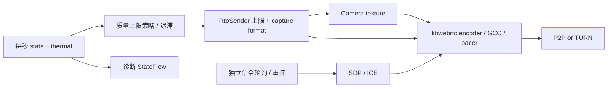

# 目标和边界

优先顺序：通话连续、音频可懂、主要目标清晰、低延迟，然后才是最高分辨率。这里的“最佳实践”是有证据、可测量、可降级的工程基线，不承诺一种参数适合所有 OEM、网络或场景。

本专项落实当前 1v1 单摄视频的质量控制、可观测性和媒体／信令隔离；双摄、屏幕共享、AR 在此基线上扩展独立 Track，不在本次引入。P2P 优先，TURN 参与正常 ICE 竞争作为连通性回退，不通过延迟获取 relay 候选假装节省连接时间。

## 验收目标（目标，不是已测成绩）

| 场景 | 验收目标 | 测量方式 |
|---|---|---|
| 已登录、前台、权限已授予、正常网络 | 接听到远端首帧 P50 ≤ 2 s、P95 ≤ 5 s | 每网络组合至少 20 次，冷启动单列 |
| 同城正常网络 | 端到端画面延迟 P50 ≤ 200 ms、P95 ≤ 350 ms | 同一外部相机拍摄现场计时器与接收屏幕，不能用 RTT/2 替代 |
| 可用带宽 ≥ 3.5 Mbps、设备支持 | 允许 1080p30 上限；实际发送／接收分辨率必须可查 | 双端 RTP stats + 真机编码器／温度记录 |
| 常规通话 | 以 720p30 启动；限制下降时先保声音和连续性 | 双端 30 分钟会话，无崩溃、持续积帧或资源泄漏 |
| 带宽 4 Mbps → 400 kbps → 4 Mbps | Native 拥塞控制立即响应；应用避免反复切档、恢复有迟滞 | 每档 30 s，记录码率、发送延迟、卡顿、升降档原因 |
| 过热 | severe 及以上主动降低视频负载，恢复后缓慢升档 | 真机热状态与编码耗时；模拟热状态仅验证逻辑 |

# 依据和取舍

1. [RFC 8836](https://www.rfc-editor.org/rfc/rfc8836.html) 要求交互媒体适应拥塞、避免排队拖长实时延迟。保留 libwebrtc 的拥塞控制、pacer、重传和音视频同步，不另造逐秒追赶估计带宽的码率控制器，不硬设高最低码率。
2. [WebRTC Trickle ICE](https://webrtc.org/getting-started/peer-connections) 支持候选发现即交换。现有 media.ice 已去掉 gathering COMPLETE 的 20 秒等待；必须先升级服务端。保留晚到 TURN 候选。
3. [原生 RtpParameters](https://webrtc.googlesource.com/src/+/refs/heads/main/sdk/android/api/org/webrtc/RtpParameters.java) 支持 maxBitrateBps、maxFramerate 和 degradationPreference。应用设置可持续的上限和 BALANCED，native 决定上限内实际码率／分辨率／帧率。每次重新 getParameters，检查 setParameters 结果，拒绝时保留原生策略并记录，不能因此挂断。
4. [默认编码器工厂](https://webrtc.googlesource.com/src/+/refs/heads/main/sdk/android/api/org/webrtc/DefaultVideoEncoderFactory.java) 包含硬件／软件组合。保持设备支持的 codec 协商与软件回退，不硬改 SDP 强制 H.264/AV1，不把 codec 名称当作硬编证明。实际 encoderImplementation 和 powerEfficientEncoder 用于诊断。
5. [W3C stats](https://www.w3.org/TR/webrtc-stats/) 区分发送、接收和远端反馈。不能用本端接收丢包推断本端上行；累计编码时间、发送延迟、jitter buffer 必须取区间增量／帧或包数量，缺失值是未知，不是零。所有差分需处理计数重置、SSRC 变化和无效采样。
6. [Android PowerManager](https://developer.android.com/reference/android/os/PowerManager#getCurrentThermalStatus()) 的 thermal status 从 API 29 可用；更低版本为未知。[Thermal API 指南](https://developer.android.com/games/optimize/adpf/thermal) 说明 OEM 可能不报告真实状态，因此结合编码耗时和 native CPU limitation，不能以 NONE 宣称设备没有过热。

# 实现结构

单次 NativeRtcSession 持有 RTC executor、采集、sender、统计循环和 EGL；释放前取消统计，不让迟到 callback 修改下一次通话。统计超时只记录采样缺失，不结束媒体。信令往返不控制统计频率；连接状态独立通过 Flow 处理。

## 质量上限

| 档位 | 采集目标 | 视频码率上限 | 用途 |
|---|---|---|---|
| ECONOMY | 640×360、15 fps | 450 kbps | 持续资源不足或严重过热 |
| HD | 1280×720、30 fps | 2.5 Mbps | 默认启动、一般网络 |
| FULL_HD | 1920×1080、30 fps | 4 Mbps | 能力与持续带宽证据都满足后升档 |

上述值是首版实验参数，不是外部标准。查 CameraEnumerator 格式能力，缺少 1080p30 时不升 FULL_HD。实际格式可由 capturer 选择邻近支持值，诊断显示实际编码尺寸而不是档位冒充实际清晰度。网络降级主要由 native BALANCED 执行；应用只对持续明显不足施加较低上限。严重热状态立即到 ECONOMY，其他恶化要求连续时间窗口，升级要求更长稳定窗口；每次切档后冷却，不能逐帧改采集格式。

上行带宽未知时不升 1080p，不把零统计当作弱网。360p 恢复允许稳定低丢包／低 RTT 后试探回 720p，避免应用码率上限反过来限制 BWE 导致永久低清。音频始终保留，不随视频降级关闭麦克风。不根据弱网主动切换 codec，避免重新协商和关键帧突发。

## 可观测性

每秒本地统计：选中候选类型、RTT、收发吞吐、实际发送／接收分辨率 FPS、可用上行、远端上行丢包反馈、编码 ms/frame、发送队列 ms/packet、接收 jitter buffer ms/frame、freeze count/duration、codec、编码器实现、热状态、应用档位和 native quality limitation。

仅记录固定事件、枚举和数值；不写 SDP、ICE 地址、token、姓名或媒体内容。不要每秒打印完整统计，UI 可按需展开。RTC_SETUP_MS 和 RTC_FIRST_FRAME_MS 的起点是采集启动，另需记录人工接听到首帧以覆盖认证、TURN credential 和初始化。

# 稳定性与剩余边界

信令短时故障不能直接销毁仍在工作的 P2P 媒体：建立后提供有界重试窗口，授权失败／协议错误仍立即结束，挂断和后台进入仍立即释放。没有无限离线通话，以便会话和远端挂断最终一致。

**网络迁移不等于自动 ICE restart。** 当前协议仍只允许一轮 offer/answer；不得只调用 pc.restartIce() 而不传递新 SDP。完整迁移需要下一版 generation、caller 主导重协商、防 glare、按 generation 隔离候选、重新获取 TURN credential 和有界重启预算。该项必须通过 Wi-Fi↔蜂窝／双真机 TURN 验证后才能宣称无感恢复，本次不伪造完成。

同样，1080p、持续低延迟、热稳定性和 TURN 成功率均需要设备数据；策略和构建测试通过不等于这些目标已经达到。

# 回归和发布

单测覆盖策略迟滞、短暂抖动、未知统计、热限制、能力降级、计数重置、方向性和增量延迟。集成检查必须确认统计不堵塞协商，统计超时不挂断，信令恢复期间媒体可继续。真机矩阵：两台 Android、Wi-Fi/Wi-Fi、Wi-Fi/蜂窝、蜂窝/蜂窝、P2P 被阻断时 TURN UDP/TLS、耳机、前后台与 30 分钟发热。

每个设备／网络组合保留基线与改进后的同口径数据及构建 commit。失败样本也纳入 P95，建立失败单列成功率。当前未测项目标为“未验证”，不能用模拟器填补真机数据。发布顺序：前一轮 Trickle 服务端 → 两端 APK → 上述验收。

# Changelog

## 1.0.0 - 2026-09-08

- 建立单摄视频质量、低延迟、媒体隔离和可测量验收基线。
