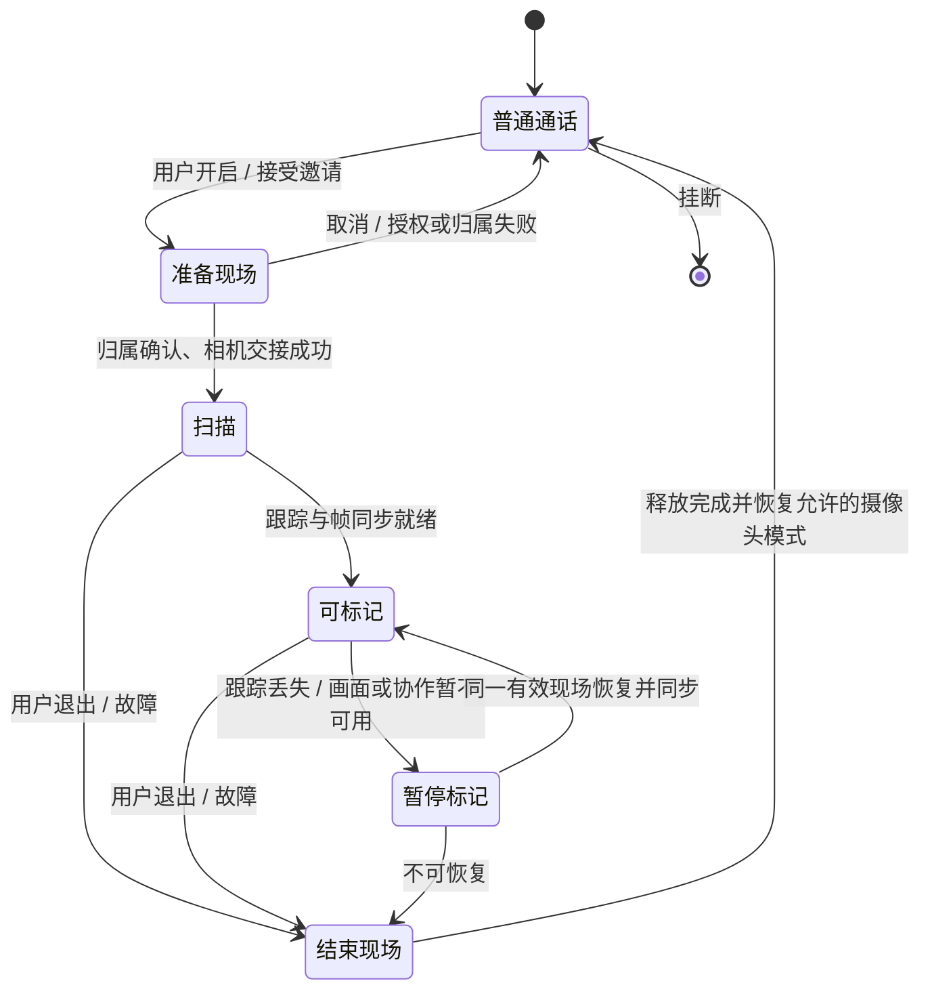

# AR 现场协作交互专项设计

本文给出可评审、可拆分实现的产品方案。**以下“首版”指拟交付的 AR 协作首版，不代表当前 APK 已具备这些行为。** 当前实现与差距见第 12 节；本次只设计，不修改运行代码，也不改变 M3 优先的路线图。

## 1. 先回答最关键的问题

| 问题 | 首版设计结论 |
| --- | --- |
| 在哪里打开？ | 通话底部“更多 → AR 现场协作”。菜单分“开启我的现场”和“请对方开启现场”；Show Me 现场画面也提供同名快捷入口。 |
| 我打开后，对方是什么样子？ | 我方后摄现场成为协作画面；对方看到现场视频和“加入标记”提示。对方摄像头保持原有开关状态，不因我开启 AR 而自动开启。 |
| 对方也要打开 AR 吗？ | 不需要。对方只需点“加入标记”，无需运行 ARCore；不支持 AR 的手机也可以作为指导方，但必须支持本应用的协作协议与视频显示。 |
| 可以同时打开吗？ | 两人可以同时参与、同时标记；首版一通电话只协作一个现场，不同时运行两个现场。可显式“交换现场”。 |
| 开启后什么不能用？ | 现场方暂不支持前摄、双摄、切换镜头和屏幕共享；整场协作期间首版暂停屏幕共享入口。语音、静音、音频路由、挂断仍可用。指导方普通摄像头可继续使用。 |
| 谁能标记？ | 现场方开启标记工具后可标自己的现场；指导方加入后也能标同一现场，无需轮流抢笔。 |
| 标记怎么清除？ | 双方能撤销自己的最近一次新增、删除自己的标记、清除自己的全部标记；现场方另外能删除任意标记、清空整个现场。 |
| 退出会怎样？ | 指导方“退出标记”只收起自己的工具，已有标记保留；现场方“结束现场”清除全部标记，恢复此前摄像头模式，通话继续。 |
| AR 除了标记还能做什么？ | 后续优先考虑编号步骤、空间文字、目标找回、参考测距、定格讲解与协作快照；跨通话保留、物体识别和三维扫描属于独立后续能力。 |

核心体验：**两个人面对同一个现场，边说边指出具体位置；拿手机的人移动时，标记尽量留在原位置。** “现场方/指导方”是当前角色，与谁拨号、谁更懂技术无关。

## 2. 模式、角色和产品边界

### 2.1 两种操作，避免一个“AR 开关”承担两种含义

- **开启我的现场**：授权把自己的后摄切换为 AR 采集，成为现场方，并允许当前通话对方主动加入标记。
- **加入标记**：对已开启的对方现场进行协作，成为指导方。只增加交互工具，不接管本机摄像头。
- **请对方开启现场**：发送一次邀请，由对方确认后开启其后摄；邀请本身不启动相机。

没有现场时，先显示两个方向选项；对方已有现场时，优先显示“加入对方现场”，把“改为我的现场”放到次级操作。自身不支持 AR 时保留此菜单，禁用“开启我的现场”并解释原因，仍允许请求/加入对方现场。

### 2.2 首版一个现场，双方共同操作

首版只允许一个现场，因为两套画面、两套坐标、两个工具目标同时出现容易误标，且双端 AR 同时运行会增加功耗和验证范围。这是产品约束，不是声称现有协议或 ARCore 绝对无法双向运行。

双方几乎同时点击开启时，需要**在接管相机之前**仲裁现场归属：以当前通话主叫端作为协作控制协调者，串行接受第一个有效申请并下发双方确认的归属版本；未获得授权的一方不启动 AR，显示“对方已开启现场，可以加入标记”。仲裁超时取消本次请求，不各自启动。协调者只处理状态消息，不转发媒体；具体消息在协议扩展时定义。当前代码尚无此仲裁。

### 2.3 交换现场

1. 指导方点“更多 → 交换现场”，现场方收到“结束当前现场，改看对方现场？现有标记将清除”。
2. 指导方先完成本机能力检查和必要授权；任一方取消、能力不足或邀请过期，原现场继续。
3. 双方同意后，旧现场停止、清空并确认释放；新现场获得归属、创建新会话后启动。不能把旧标记迁到另一人的房间。
4. 新现场启动失败则回到普通通话，提示重试；不自动重新开启任一方相机模式中的 AR。

邀请默认 20 秒有效，同类邀请同时最多一个；拒绝后 30 秒内不重复打扰。这些是初始交互参数，需可用性测试调整。身份、邀请有效期、离开通话后的回调均需重新校验。

## 3. 开启流程与双方所见

### 3.1 从普通通话开始

| 阶段 | 现场方 A | 指导方 B |
| --- | --- | --- |
| 选择 | 更多 → AR 现场协作 → 开启我的现场 | 继续原通话，不强制改变布局 |
| 说明/授权 | “将切换后置摄像头，把现场画面分享给对方；对方加入后可放置标记。双摄将暂停，结束后恢复。”提供继续/取消 | 无需点击授权，不替 A 确认摄像头权限 |
| 准备 | 按需申请摄像头权限，检查/安装 AR 服务；准备失败仍可通话 | 必要时看到“对方正在准备现场”，不显示可点击标记工具 |
| 启动 | “正在开启现场”，始终可取消；已有摄像头正常释放后才交接 | 视频切换时展示“现场画面切换中”；旧帧如保留必须遮罩并标明，不能看似仍是实时画面 |
| 扫描 | 本机后摄大画面，“缓慢移动手机，识别桌面或墙面” | 后摄现场大画面，“对方正在识别环境”；可加入，但放置工具暂不可用 |
| 就绪 | “我的现场 · 可放置标记”；显示对方是否已加入 | 提示“对方开启了现场”，按钮“加入标记 / 仅观看” |
| 协作 | 看到本地实时场景与双方已确认的标记 | 看到同一现场视频与确认后的标记；其视角是 A 的摄像头视角，不是自由三维漫游 |

安装/权限返回后必须再点击开启；不能因迟到回调、旋转重建或重新前台而自动发送现场画面。当前应用进入后台会结束通话，首版沿用并明确告知，不在本专项中偷偷引入后台通话。

### 3.2 布局规则

- A 默认大画面为“我的现场”；B 默认大画面为“对方的现场”。B 的人像视频若正在发送，可作为 A 的小窗；A 的前摄关闭后，用头像/名称替代人像，不保留会误认为直播的旧人脸帧。
- B 可保留自己的原摄像头预览，低负载时保留原普通双摄；带宽/温度紧张时先减少辅助视频。A 启动 AR 不强制关闭 B 的相机。
- 大画面顶部固定显示现场归属、跟踪状态、参与情况；底部为标记工具与通话控制。横屏把工具移到侧边，挂断与结束现场保持可见。
- 用户可切换小窗查看人像；离开现场大画面即退出当前绘制手势并收起放置工具。显眼的“返回现场”负责回到可标记画面；不在小窗里放置标记。
- AR 标记层只属于现场视频，不覆盖整块屏幕、对方人像、通话按钮或黑边；旋转/裁切变化中取消未提交手势。
- 状态变化用短提示，不反复弹窗。标记工具选中时不自动隐藏；操作区触控目标至少 48 dp，作者用文字/形状加颜色区分，支持 TalkBack。

双端布局草图（结构示意，不是最终视觉稿）：

```text
现场方 A                          指导方 B
┌─────────────────────┐          ┌─────────────────────┐
│ 我的现场 · 可标记    │          │ 对方现场 · 可标记    │
│ 对方已加入          │          │ 正在与对方共同标记   │
│                     │          │                     │
│   本机后摄实时画面  │          │   A 的现场视频       │
│   + A/B 的空间标记  │          │   + 同一组空间标记   │
│             [B小窗] │          │             [我小窗] │
│ 查看 指示 钉住 箭头 圈│          │ 查看 指示 钉住 箭头 圈│
│ 撤销   标记管理      │          │ 撤销   标记管理       │
│ 静音 路由 结束现场 挂断│         │ 静音 路由 退出标记 挂断│
└─────────────────────┘          └─────────────────────┘
```

### 3.3 指导方暂时不加入

选择“仅观看”后仍看到现场和已存在的标记，工具栏不出现；画面保留“加入标记”轻入口。现场方可以先独自放置标记。用户加入后，只有握手和标记状态同步完成才启用工具，不能把按钮按下当作已加入成功。

## 4. 标记的操作语义

### 4.1 工具设计

| 工具 | 手势与反馈 | 绑定方式 | 范围 |
| --- | --- | --- | --- |
| 查看 | 默认工具；点空白只显隐控制栏，点已有标记查看作者/编号 | 不创建内容 | 首版 |
| 指示 | 按住并拖动显示作者色光点；松开后 1 秒淡出 | 明确为“临时指示”，不是固定空间标记 | 首版，复用 M3 的 2D 能力 |
| 钉住 | 选工具后点目标，出现空心等待图标，确认后为实心 Pin | 现场世界坐标中的锚点 | 首版首个交付工具 |
| 箭头 | 首版点目标放置固定形态的指向标记，箭头尖端落在目标；不承诺用户指定三维朝向 | 单锚点、面向现场摄像头的图标 | 首版后续小步 |
| 圈 | 点目标放置固定大小的目标圈，不绘制任意范围或轮廓 | 单锚点、面向现场摄像头的图标 | 首版后续小步 |
| 画笔/自由圈选 | 自由绘制，仅在单独的“画面标注”模式使用 | 2D 视频/定格画面坐标 | M3 能力，AR 首版不混入空间工具 |

箭头与圈首版表达“这里”，不是三维向量、物体尺寸或贴在曲面上的边界。后续若做拖拽方向、调大小、表面贴合，必须扩展模型与协议，不能只改工具图标。

Pointer 不创建 Anchor，不占标记列表。只在双方正在观看同一现场且帧足够新时显示；晚到或缺帧指示直接丢弃。现场画面移动时不得把旧坐标当作当前物体位置：接收端需做帧有效性判定，无法稳定匹配时隐藏，并建议用“钉住”；这一工具不保证随物体移动。

### 4.2 放置的确认与失败

1. 从用户实际看到的那一帧取位置与帧引用。本地点击也走相同语义，不能从 UI 点击直接拿另一时刻的当前姿态。
2. 立即显示仅本机可见的“正在放置”空心反馈；尚未确认时不显示永久编号，也不占用“成功”提示。
3. 现场端解析有效历史帧、表面和跟踪状态，创建锚点后统一分配编号并同步。双方以确认结果显示标记。
4. 当前没有可靠显示帧引用时，整个空间放置工具禁用，文案“画面同步准备中”；单次帧过期时取消本次放置并提示“画面已变化，请重新点选”。
5. 无表面时提示“暂时无法固定在这里，请换个位置或缓慢移动手机”；不把失败的 AR 点击偷偷变成 2D 成功。

等待 2 秒仍无确认显示“正在确认”；5 秒进入“结果待同步”，暂停继续放置并请求权威状态同步。这是建议超时值。结果未知时不能提示“已失败”后自动换 ID 重试，否则可能双重创建；同步后恢复或按失败策略结束 AR，基础通话保留。

### 4.3 标记显示

- 统一编号在一个现场内递增，不因删除重排。例：“3 · 我”“4 · 对方”；两端“我/对方”随视角转换，但编号与作者身份一致。
- 内容颜色按稳定作者身份分配，两端一致；不把绿色/黄色单独作为成功或失败信号。
- 首版图标有深度感，但不宣称真实遮挡；不具备正确遮挡时不模拟穿墙可见的可靠位置提示。目标移出视野后留在标记列表，不贴在屏幕边缘伪装当前位置。
- 场景中的物体若被拿走，标记仍属于原空间位置。首次教学明确“适合固定物体；物体移动后需要重新标记”，不称为物体追踪。
- 同时最多 32 个空间标记（沿用当前框架上限）；达到上限时显示“标记已满，请删除一些”，禁止自动删除对方内容。

## 5. 双方同时标记、撤销和清除

### 5.1 权限矩阵

| 操作 | 现场方 | 已加入的指导方 | 仅观看的指导方 |
| --- | --- | --- | --- |
| 新建、临时指示 | 可以 | 可以 | 不可以 |
| 撤销自己最近一次已确认新增 | 可以 | 可以 | 不可以 |
| 删除/清除自己的标记 | 可以 | 可以 | 不可以，需先加入 |
| 删除对方单个标记 | 可以，标记管理中注明作者 | 不可以 | 不可以 |
| 清空整个现场 | 可以，二次确认并告知对方 | 不可以，可请求现场方清空 | 不可以 |
| 结束现场/禁止对方继续标记 | 可以 | 不可以，可退出标记 | 不可以 |

“我能标记”与“我能开相机”分开授权。现场方在参与菜单中可关闭“允许对方标记”，对方立即回到仅观看，停止接受新的修改；已有标记保留。重新允许不自动让对方加入。首版不提供任意编辑对方文字、拖动对方锚点或接管手机。

### 5.2 具体清除入口

- 工具栏常驻“撤销”：删除自己最近一个仍存在、已确认新增的标记；不会撤销对方操作，也不会复活自己刚删除的标记。无可撤销项时禁用。
- 点标记 → 小卡片：“编号、作者、删除”。未授权时不显示可执行删除。
- “标记管理” → 列表可定位/删除；首版“定位”只高亮当前画面内目标，画面外提示“目标不在当前视野”。
- “清除我的标记” → 确认“删除你在此现场的 N 个标记？双方都将看不到。”
- 现场方“清空现场标记” → 确认“删除双方全部 N 个标记？此操作不能撤销。”指导方显示“对方已清空现场标记”。
- 后续“暂时隐藏标记”应是本机查看选项，两端不联动；隐藏时有常驻提示和恢复按钮，并切换到查看工具，避免盲目创建。隐藏不等于删除。首版渲染方案不支持单端隐藏，因此暂不展示此入口，见第 9.1 节。

首版删除/批量清空不提供恢复，避免把过期空间位置重新当成可靠标记。“撤销”只覆盖新增，工具说明必须写清楚。

### 5.3 并发与一致性

双方可同时创建，各自拥有独立工具选择和待确认反馈。现场端作为标记权威，串行提交所有本地与远端操作；作者从已鉴权通话身份推导，不信任消息里任意填写的角色。

为避免“刚清空又冒出来”，每次全量清空增加清空代数。清空前发起但晚到的 create 必须拒绝；清空确认前暂禁本端新建，收到新代数后才恢复。清除自己的标记需同等的作者代数或事务边界，不能用多条无界 remove 模拟成功。已提交在清空前的标记被清掉，清空后明确新建的标记允许存在。

删除同一个 ID 幂等；已删除 ID 不复活。撤销必须指定 marker ID，不发送含糊的“撤销上一条”。指导方离开/被撤销权限时，已提交操作保留；尚未提交的排队操作重新核验加入代数并拒绝。UI 从确认后的权威版本更新，不能只乐观消除图形而未删除锚点。

## 6. 功能兼容矩阵

以下为 AR 协作首版策略，不能据此推断当前 APK 已实现所有拦截或恢复。

| 功能 | 现场方 A | 指导方 B | 用户操作后的反馈 |
| --- | --- | --- | --- |
| 麦克风静音、听筒/扬声器/蓝牙、挂断 | 可用 | 可用 | 不受标记工具状态影响 |
| 普通前摄、双摄 Show Me | 暂停；仅后摄 AR | 可保留普通摄像头模式 | A 点击时提供“结束现场并切换”，说明清除标记 |
| 切换前后摄、物理镜头切换 | AR 内禁用 | 普通模式能力内可用 | A 需先结束现场，不能无提示丢失坐标 |
| 关闭自己的摄像头 | 立即停止 AR 和发送，清空现场 | 只关闭 B 的摄像头，仍可指导 | 隐私关闭操作不弹阻挡确认；重新开启不自动重开 AR |
| 屏幕共享（任一方） | 与整场 AR 协作互斥 | 与整场 AR 协作互斥 | 先结束 AR 再走系统共享授权；取消结束则保持原模式 |
| 正在共享时开启 AR | 先主动停止共享 | 邀请须明确结束共享 | 不承诺停止后系统共享可自动恢复 |
| 画面切换、横竖屏 | 可用 | 可用 | 非现场大画面禁用放置，旋转取消未完成手势 |
| 画面缩放/裁切 | 首版空间操作时关闭手势缩放 | 同左 | 后续精确支持显示帧变换后再开放；不限制必要编码等比例缩放 |
| 美颜、背景替换、额外防抖 | 首版现场画面不开放 | 普通视频依已有能力 | 防止破坏空间映射；不暗示项目已有这些功能 |
| 分辨率/FPS/码率选择 | 只显示可用的 AR 档位；不允许导致采集重建的随意切档 | 接收质量可自适应 | 网络拥塞控制继续；采集重建需结束旧现场 |
| 后台、锁屏、跳转安装页 | 按现有生命周期停止 AR；应用后台结束通话 | 按现有通话策略 | 回来后显式重新开始，不恢复旧标记 |
| 拍照、录屏、远程控制 | 首版应用内不提供 | 同左 | 后续截图须独立定义可见提示与保存授权 |

“结束现场并切换”是用户明确模式切换，仅确认时停止；失败时保留语音并显示实际恢复状态。一般结束 AR 恢复进入前 FACE/BACK_ONLY/DUAL；原模式恢复失败降级单摄并提示，不能 UI 宣称双摄已恢复但只出一路。挂断、关相机或后台不执行自动摄像头恢复。

模式的拥有者保留决定权：指导方想开始共享，须先请求现场方结束 AR；另一方正在共享时，开启现场须先请求共享方停止。对方拒绝或未响应则维持现状，不能通过一个本机确认框擅自停止对方模式。原模式已结束而下一模式被取消时停留普通通话，用户可显式重新开启。

## 7. 跟踪丢失、弱网与退出

| 状态/事件 | 画面与工具 | 恢复/退出规则 |
| --- | --- | --- |
| 扫描中 | 视频继续，永久放置禁用；指导“缓慢移动，找有纹理的表面” | 只有可用跟踪与历史帧才启用放置；扫描 15 秒可提示换位置或普通视频，不自动切模式 |
| 跟踪丢失 | 常驻提示“定位暂时丢失”；隐藏不可靠空间图形但保留列表，禁用新增，允许删除 | 同一有效会话且锚点恢复跟踪后才重新显示，不把旧坐标贴到当前画面 |
| 摄像头遮挡/低光 | 视频与明确原因提示；不反复弹安装框 | 改善环境；用户可结束现场 |
| AR 暂停、Session 重建、世界坐标失效 | 清除空间标记并告知双方 | 新 UUID、重新扫描；不承诺原位置恢复 |
| 视频停滞、无帧身份或严重积压 | 标记工具暂停，显示“画面延迟，暂不能标记”；旧画面明确非实时 | 收到可验证的新帧并完成状态同步后恢复；不能对静止旧图照常创建 |
| 临时网络切换 | 语音重连沿用 RTC；禁用远端修改，不积攒操作待网络恢复重放 | 同一现场仍有效时先同步标记快照再恢复；否则结束旧现场 |
| 只有语音可用 | 退出 AR，释放采集/锚点，保留语音 | 网络恢复后只提示可重新开启，不自动启动 AR |
| 持续过热或资源不足 | 优先减辅助视频和 AR 渲染负载；仍不足时提示并结束 AR | 沿用媒体保护策略，阈值需设备验证；不降低语音优先级 |
| AR 控制通道失败 | 显示“协作连接中断，已结束现场”，关闭 AR；普通通话继续 | 当前通道终止后不能假装本通话内可重开；提示重新通话后再试 |
| 指导方退出标记 | 收起工具，已有标记保留，A 看到“对方仅观看” | 再加入须同步完整标记状态 |
| 现场方结束 | 无标记时直接结束；有标记时确认清除 | B 返回普通观看，A 恢复先前摄像头模式；恢复未完成时显示状态 |
| 挂断/隐私关相机/强制资源释放 | 立即停止；取消待处理操作，清除空间数据 | 不因清除确认阻挡紧急退出 |

返回键顺序：先关闭标记详情/菜单，再取消当前放置工具并回到查看，再触发“结束现场”（现场方）或“退出标记”（指导方）；退出 AR 不等于挂断，挂断按钮始终独立。



这是产品状态；“对方是否加入”和“本机选中什么工具”分别建模，不能强行塞进 ARCore 的跟踪枚举。任一活动状态收到挂断均直接进入通话清理。

## 8. AR 除了标记，还值得做什么

| 能力 | 用户价值与基本交互 | 优先级与边界 |
| --- | --- | --- |
| 编号步骤、完成状态 | “先按 1，再转 2”；给 Pin 加短说明、勾选完成并跳到下一步 | P1，先做短文字和顺序；权限/修改冲突需扩展 |
| 目标找回 | 点击列表中的 3，提示移动手机找回目标 | P1；只有可靠跟踪时给方向，不能承诺遮挡后的物体追踪 |
| 空间文字 | 文字说明贴在固定设备位置，减少反复口述 | P1；文字长度、遮挡、键盘期间工具行为需另补细节 |
| 定格讲解 | 双方协商选定同一张图，在图上画线；音频继续，明确“定格画面”，点“回到实时”退出 | P1，属于 2D 协作；定格过久禁止拿旧图新增空间 Anchor，不冒用已过期历史缓存 |
| 参考测距 | 选择两个有效空间点，显示两点直线距离，可切换 cm/m | P2；需精度实测与可靠性提示，不用像素估尺寸，不作为专业测量工具 |
| 协作快照 | 用户主动保存当前现场和说明，方便事后操作 | P2；双方可见提示、由现场方允许；默认不保存视频、房间地图或传感器数据 |
| 空间路径/区域 | 在固定场景给出移动或安装位置建议 | P2；须先解决表面朝向、多点几何和遮挡，不作为安全导航 |
| OCR/物体识别 | 指向铭牌读取型号，定位说明书 | 独立候选，非 ARCore 自带识别能力；需成本、隐私和识别错误设计 |
| 跨通话保留/再次到场恢复 | 下次通话看到原标记 | 长期候选，需要持久化与重定位；不是保存几个世界坐标即可实现 |
| 三维扫描、自由视角查看 | 保存/浏览场景模型 | 暂缓：数据、带宽、算力与隐私成本明显增加，不是 AR 视频自然附带的能力 |

先验证“远程指得准、现场看得懂”，再决定扩展优先级。不会因为功能可想象就一次性加入首版；云锚点、多人、远程点击操作系统、游戏化特效均不属于当前范围。

## 9. 渲染与数据约束对交互的影响

### 9.1 双方看到同一组标记的推荐路径

首版建议现场端在 AR GPU 管线中渲染已确认空间图形，并随现场视频发送；本地预览复用同一场景渲染结果。指导方解码后直接看到与该帧相匹配的图形，不在指导方用“最新姿态”二次绘制空间锚点。工具栏、作者列表、待确认光标在本机 UI 中绘制，不烧进媒体。

这会修改后摄画面内容，但仍保留独立 video_back Track，不合并前后摄。需要明确：指导方的“暂时隐藏标记”若依赖已烧入视频的图形就无法只对本机生效。因此**首版按此渲染方案不开放本机隐藏入口**；第 5.2 节定义其未来语义，待支持原始画面与匹配帧叠加层分离后再开放。

指导方点击已有标记还需要准确命中：随源帧同步有界的 marker ID 与可点击二维范围，严格绑定展示帧，不能凭最新列表推算屏幕位置。元数据不匹配时只禁用画面选中，仍可用“标记管理”列表删除。实现初期可先仅提供列表操作，之后补画面命中；两端不得重复画同一标记。

### 9.2 需要扩展的协作能力

现有 v1 只有 ready/join/joined/leave/ended/create/remove/clear/result，不足以实现本设计。正式接入前需独立版本化协议设计，至少包含：

- 能力协商、单现场申请/授权、交换邀请与超时、现场归属版本；旧客户端不开放未协商功能。
- 标记作者、统一编号、权威状态版本、创建/删除/清空确认、本地操作广播、加入/重连快照与删除墓碑。
- 全量/按作者清空代数、撤销指定 ID、操作 ID 幂等语义、参与与授权代数。
- 现场跟踪/可标记状态、失败理由、完整会话结束；指导方不能只凭视频正在播放推断可以标记。
- 指示与命中元数据按帧关联；高频可丢指示应采用独立有界传输策略，不能耗尽可靠标记通道的预算。

不能把附加字段直接塞到 v1：当前解码器严格拒绝未知字段。设计新版本与能力握手，明确旧版本降级为普通视频/仅观看，保持其他通话通道可用。不得把 `join` 当成远程相机授权，也不得把 `result` 成功当作所有客户端标记列表已同步。

当前默认 32 个同时 Anchor、每会话 512 个不同 ID、历史缓存 3 秒/180 帧。这些是框架限制，不是延迟或精度承诺。首版若保留生命周期预算，接近预算应提示“本次现场标记次数将用尽”；达到上限拒绝新增，仍可删除和结束，用户显式重开并明确会清空，不能偷偷刷新会话。

## 10. 首次教学与关键文案

首次仅三条可跳过说明：

1. “用后置摄像头对准现场，缓慢移动，让手机识别环境。”
2. “你和对方都能标记；固定标记会留在空间中，物体移动后要重新标。”
3. “结束现场会清除标记，语音通话继续。”

| 场景 | 文案 |
| --- | --- |
| 对方邀请 | “对方想查看并标记你的现场。开启后会分享后置摄像头画面。” 开启 / 暂不 |
| 对方加入 | “对方已加入，可以共同标记。” |
| 本机不支持 | “这台设备不能开启 AR 现场，仍可加入对方现场或使用普通视频。” |
| 有 AR、无 Depth | 正常显示入口；无法落点时提示换表面，不向用户要求“启用 Depth” |
| 仅观看 | “你正在观看对方现场。” 加入标记 |
| 权限被撤销 | “对方已暂停你的标记权限，你仍可观看和通话。” |
| 重建现场 | “定位已重置，原有标记已清除，请重新扫描。” |
| 退出确认 | “结束现场并清除双方标记？通话将继续。” 结束现场 / 继续协作 |

技术错误码进入结构化日志，用户只看到原因和可执行动作。首次开启沿用现有 ARCore 说明与外链；不额外索取麦克风、定位、存储等与当前动作无关的权限。

## 11. 验收场景

以下是未来实现的验收要求，本次文档任务未执行设备测试。

| 场景 | 必须观察到的结果 |
| --- | --- |
| A 从 FACE/BACK_ONLY/DUAL 开启和结束 | 两端主画面归属明确，前摄停止，无旧人像伪直播；正常退出恢复原模式，失败有真实提示 |
| B 不支持/未安装 ARCore | 能观看、加入并标记 A 的现场，不要求 B 安装 ARCore |
| A 不支持、拒绝相机、拒装服务 | 不启动现场，不影响原通话；不自动重弹、重开相机 |
| 双方同时开启/交叉邀请 | 只有一个现场获准并启动，没有双 AR 抢占或双方等待死锁 |
| 双方同时放置/同点放置 | 保留两个独立作者标记，编号与最终列表一致，不丢失任一合法操作 |
| 新建与全清空交错、重复删除、迟到回执 | 旧请求不复活内容；最终快照一致；结果未知不显示假成功 |
| 指导方试删对方内容、撤权后的在途操作 | 权限由现场端拒绝，不能靠隐藏按钮实现权限限制 |
| 指导方退出再加入 | 原标记仍在；快照完成前工具禁用；撤销历史与本人可删除项一致 |
| 无 Depth、无表面、快速移动、反光/低光 | 无可靠定位则明确拒绝，不使用当前 Pose 冒充历史点击，也不把 2D 当 AR 成功 |
| 横竖屏、180°、FIT 黑边、不同屏幕比例 | 位置与实际展示帧一致；黑边和小窗不能放置，切换中手势取消 |
| 跟踪丢失/重建 | 图形不假装稳定；原 session 恢复可验证后显示，失效则清空并通知 |
| AR 中点切镜头、双摄、共享、关相机 | 符合第 6 节；取消模式切换不影响现场，隐私关相机立即生效 |
| 视频积压/ICE 切换/通道失败 | 不重放离线点击；恢复先同步；AR 故障不主动结束普通音频通话 |
| 挂断、后台、退出启动中、迟到授权 | 清理相机/EGL/锚点/排队命令，无自动复活；沿用后台结束通话策略 |
| 上限、连续创建删除、30/60 分钟 | 容量提示可理解，锚点及时释放，功耗/温度/音频质量有设备数据 |
| 老版本、无可信帧身份的视频编码路径 | 不开放空间放置，保留可用的普通视频或明确仅观看 |

单元测试重点：归属仲裁、权限、清空代数、幂等、结果待同步、状态映射与坐标变换；集成测试覆盖协议和本地/远端操作汇合；真机至少使用两台物理设备覆盖相机、渲染、历史帧与弱网。记录放置确认延迟 p50/p95、拒绝原因、锚点漂移、恢复耗时、音频中断、温度与功耗；没有实测前不写“高精度”“零漂移”。

## 12. 当前实现、文档差异和拆分计划

以仓库 `fe36524` 为阅读基线：

| 已核查对象 | 当前能力 / 与本设计的差距 |
| --- | --- |
| [ArCallControls.kt](../../android/app/src/main/java/com/lazydoglab/zisee/ui/ArCallControls.kt) | 更多菜单内已有“AR 现场视角 / 开启 AR”、说明/安装/权限、状态与退出；明确提示远端空间标注尚未开放。尚无本文完整双角色入口。 |
| [ActiveCall.kt](../../android/app/src/main/java/com/lazydoglab/zisee/ui/ActiveCall.kt) | AR 后摄视频槽和通话选项已接入；本文协作工具、角色布局、全套冲突交互尚待实现。 |
| [ArCollaboration.kt](../../android/app/src/main/java/com/lazydoglab/zisee/ar/collaboration/ArCollaboration.kt) | 有本地/远端 session 和加入握手；不能认为已有单现场仲裁、作者权限、版本快照或双方本地标记广播。 |
| [ArSessionController.kt](../../android/app/src/main/java/com/lazydoglab/zisee/ar/session/ArSessionController.kt) | 有历史投影、Pin/Arrow/Circle 类型和锚点删除/清空；无作者元数据、工具完整几何或产品撤销语义。 |
| [AR_FRAMEWORK.md](../architecture/AR_FRAMEWORK.md) | 记录现场采集、GPU 管线、帧身份与协议；开头“通话按钮待完成”等历史叙述落后于当前代码，应结合实际代码和近期记录阅读。本文不将历史测试数字当作重新验证结果。 |
| [CURRENT_TASK.md](../../CURRENT_TASK.md) | 记录已有设备相机接管与帧身份检查；同时明确双设备空间点击/叠加未验证。 |
| [DESIGN.md](DESIGN.md)、[ARAssist.dc.html](../../design/ARAssist.dc.html) | 提供视觉方向与单屏概念；尚未解决双方角色、权限、并发。本文为细化提案，不将原型视为已交付行为。 |
| [ROADMAP.md](ROADMAP.md) | M3→M4/M5 顺序维持；早期 M4 误差容忍描述不构成使用错误历史帧或当前 Pose 的许可。 |

建议以可验证小步推进：

1. **协作会话与双端 UI**：完整入口、单现场仲裁、加入/退出/撤权、功能互斥与降级；暂不开放空间点击。
2. **Pin 端到端闭环**：正确展示帧引用、现场叠加、双方新增、作者/编号同步、列表删除、本人撤销、事务清空、重连快照；完成两设备验证后才开放入口。
3. **首版工具补齐**：固定形态箭头/圈、按帧命中、临时指示、教学与压力测试；复用 M3 基础，不一次扩展三维编辑器。
4. **首版便捷切换与 P1 增强**：先补齐第 2.3 节的交换现场，完成首版便捷切换；此前 UI 只提供“结束后由对方开启”，不展示无实现按钮。之后独立推进文字/步骤、目标找回与定格讲解。

双现场同时开启留待后续独立评审：需要每个 scene 独立 session/作者/列表/清除范围、显式“我方现场/对方现场”切换、只有当前大画面可编辑、无跨场景坐标投射，以及两端持续功耗验收。基础协议可保留扩展空间，首版不暴露该入口。

## 13. 技术依据与待验证假设

- ARCore 以相机运动跟踪和环境理解支持空间内容；本设计据此选择“一个现场 owner + 远端视频协作”，不是把两端放进天然共享的世界坐标。参考 [ARCore 基础概念](https://developers.google.com/ar/develop/fundamentals)。
- Depth 并非所有 ARCore 设备都支持，因此本文保留无 Depth 的平面降级，不把“有 AR”视为“有深度”。参考 [Depth 官方说明](https://developers.google.com/ar/develop/depth)。
- Anchor 的位置会随世界估计更新，因此本文要求跟踪丢失反馈与真机漂移验证，不能承诺永久固定。参考 [Working with Anchors](https://developers.google.com/ar/develop/anchors)。
- 跨时间/跨设备持久化是额外能力，本地会话坐标不足以达成；Cloud Anchors 涉及独立服务流程，本项目首版不启用。参考 [Cloud Anchors](https://developers.google.com/ar/develop/cloud-anchors)。

需要用户测试验证的假设：双方是否理解“开启现场”和“加入标记”的区别；一现场是否足够覆盖主要场景；持机时点屏幕与中心准星哪种更稳；固定箭头/圈是否足够表达意图。初版按本文默认落地，以可用性测试结果迭代，不阻塞协议正确性与相机隐私边界。

## Changelog

### 1.0.0 - 2026-09-10

- 建立 AR 现场协作专项提案，覆盖入口、双方视角、单现场并发、共同标记、删除权限、互斥功能、生命周期与扩展范围。
- 明确现有实现边界、协议/渲染缺口、分步交付与双设备验收标准。
