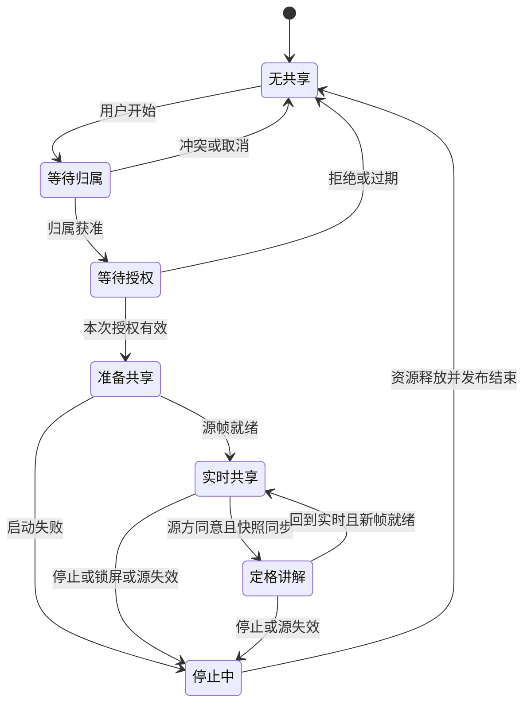

# M3 通话多任务、屏幕共享与画面协作专项设计

本文定义产品目标；当前已经进入 M3 开发，M3-F 共享框架、M3-A 后台通话、M3-B 小窗/PiP 与 M3-C 屏幕共享已形成代码闭环，架构事实分别见 [SCREEN_SHARE.md](../architecture/SCREEN_SHARE.md) 与 [ACTIVE_CALL.md](../architecture/ACTIVE_CALL.md)。「改由我共享」邀请、AR 与共享的跨端互斥、定格讲解仍未实现。下文包含目标行为与已标注的实现进度，未完成项不能当作当前 APK 能力，全部生命周期行为待双设备验收。

## 1. 核心决策

| 用户问题 | M3 目标行为 |
| --- | --- |
| 通话时按 Home、打开其他 App？ | 通话继续，默认进入系统画中画看对方；不再因为 Activity 停止而挂断。 |
| Show Me 缩小后看哪个？ | 看当前选中的对方画面，默认对方后摄现场；小窗只显示一路，返回通话可看全部。 |
| 我在共享手机，浮窗放什么？ | 放对方视频或头像，并显示“正在共享”；不在浮窗回放自己的共享屏幕。 |
| 共享时我的摄像头怎么办？ | 全部暂停并释放设备，只发送屏幕和语音；停止共享后自动恢复共享前的相机布置。 |
| 对方在共享，我切后台？ | 浮窗显示对方共享内容，保持完整比例；小字看不清时返回通话放大。 |
| 现场方开 AR 后切后台？ | 结束 AR 现场并清除空间标记，语音继续；浮窗看指导方。回来后显式重新开启现场。 |
| AR 指导方切后台？ | 浮窗继续看现场及视频内已有标记，暂停自己的标记交互；不结束对方现场。 |
| 对方切后台，我看到什么？ | 仍显示其实际发送的画面；摄像头暂停时用头像及原因替代，不伪装冻结帧为实时。 |
| 共享时对方怎么指给我看？ | 首版支持请求“定格讲解”，双方回到咫尺看同一帧并画线；跨其他 App 的直接笔迹覆盖是后续可选能力。 |
| 点击屏幕共享能顺便远程操作吗？ | 不会。标注只表达位置，不向 Android 注入触摸，不请求无障碍服务。 |

三个不同的“小窗”必须统一命名：**通话内小画面**是现有多 Track 布局；**应用内迷你通话**用于浏览咫尺其他页面；**系统画中画（PiP）**用于打开其他 App。前两者可自定义拖拽，第三者的位置、缩放、关闭手势由系统管理。M3 基础功能不申请“显示在其他应用上层”权限。

## 2. 当前实现与需要补齐的基础

| 已阅读对象 | 当前事实 / 设计影响 |
| --- | --- |
| [MainActivity.kt](../../android/app/src/main/java/com/lazydoglab/zisee/MainActivity.kt) | 已接入应用内迷你通话和系统 PiP；`onStop` 根据 PiP 是否可见决定保留或暂停视频，`onPause` 继续清理本机 AR。 |
| [CallViewModel.kt](../../android/app/src/main/java/com/lazydoglab/zisee/call/CallViewModel.kt) | 当前由 `AppContainer` 进程级持有，Activity 重建不结束通话；仍需提取独立 `CallSessionCoordinator`，进程死亡不恢复媒体。 |
| [AndroidManifest.xml](../../android/app/src/main/AndroidManifest.xml) | 已声明通话前台服务、PiP 与 `mediaProjection` 服务类型；运行时按是否共享显式选取类型。 |
| [CallVideoLayout.kt](../../android/app/src/main/java/com/lazydoglab/zisee/ui/CallVideoLayout.kt) | 已有稳定来源 ID、FIT 布局、观看质量请求、紧凑窗口单远端来源解析、`PeerScreen` 屏幕来源与主画面层序契约。 |
| [Annotation.kt](../../android/app/src/main/java/com/lazydoglab/zisee/ar/annotation/Annotation.kt) | `Annotation2D` 只有帧引用和点，不能直接支持笔画、作者、撤销与共享快照。 |
| [build.gradle.kts](../../android/app/build.gradle.kts) | minSdk 26、targetSdk/compileSdk 35；需覆盖不同系统版本与 OEM，不能仅按最新系统开发。 |

保留既有独立 Track、相机降级、音频优先、AR 展示帧关联与通话状态机。先提取生命周期 owner 和展示状态，再接共享；不重写来电推送体系，不将媒体改为中心转发。

## 3. 统一产品模型与通话界面

### 3.1 分开表示“在分享什么”和“在哪里看”

通话连接状态沿用现有状态机。另行建模：

- 展示容器：`FullCall / InAppMini / SystemPip / BackgroundNoVideo / Locked`。分屏可见属于 FullCall 的窗口尺寸变化，不能仅凭失去焦点判定后台。
- 本机相机意图：关闭、人像、后摄、Show Me；实际采集状态还包含暂停原因，意图不等于硬件正在工作。
- 协作归属：`None / Screen(owner, session) / Ar(owner, session)`；每通电话首版最多一个屏幕共享或一个 AR 现场，二者互斥。
- 标注上下文：无、实时临时指示、定格 2D、AR 空间标记；每个上下文绑定来源、会话及版本。
- 本机观看选择：主画面来源、用户是否固定选择、工具状态、容器内布局。它不能改变对方摄像头授权。

组合由策略计算允许操作与实际资源，不增添一组彼此矛盾的 `isSharing/isAr/isBackground/isDual` 开关。

### 3.2 全屏与应用内迷你通话

全屏顶部显示“正在看：对方屏幕 / 对方现场 / 对方人像 / 我的现场”，并独立显示“我在发送：麦克风、摄像头、屏幕”。静音、摄像头关闭、网络恢复使用文字与图标，不仅依靠颜色。

底部一级控制保留静音、音频路由、相机、更多、挂断；协作中另有常驻“停止共享 / 结束现场 / 回到实时”，不藏进更多。模式入口统一放在“更多 → 展示与协作”：Show Me、共享我的屏幕、画面标注、AR 现场协作。选择不兼容操作时明确要结束什么，由实际 owner 同意。

新共享/现场就绪后，普通观看状态自动切到协作画面一次；若用户固定了画面或正在绘制，仅展示“对方开始共享 · 查看”，不抢走操作目标。原主来源结束后，优先选仍有效的对方协作源，再选对方现场、人像、头像；不把本机预览悄悄当成对方画面。退出协作恢复之前仍有效的观看选择。

通话内小画面可以换主、拖拽、吸边；系统 PiP 不堆叠四宫格或“窗中窗”。应用内最小化后展示一个可拖拽迷你通话，点开回通话；菜单提供静音、恢复、挂断。返回键先关闭弹层、取消绘制，再最小化通话；AR 现场方最小化前说明现场将结束，拒绝则留在现场。系统 Home 无法阻挡，直接按生命周期规则清理。

### 3.3 双端结构示意

```text
A 共享手机并操作其他 App         B 留在咫尺观看
┌────────────────────┐         ┌────────────────────┐
│ 其他 App 的正常界面│         │ 对方屏幕 · 实时    │
│                    │         │                    │
│ 点击由 A 自己操作  │         │ A 的屏幕（FIT）    │
│          ┌────────┐│         │                    │
│          │ B 视频 ││         │           [A人像]  │
│          │共享中  ││         │ 请求定格讲解       │
│          └────────┘│         │ 静音 路由 更多 挂断│
└────────────────────┘         └────────────────────┘

AR 指导方 B 切后台              AR 现场方 A 切后台后，B 所见
┌────────────────────┐         ┌────────────────────┐
│ 其他 App           │         │ 对方已结束现场    │
│       ┌───────────┐│         │ 语音通话继续      │
│       │ A现场+标记││         │ A 头像             │
│       │仅观看     ││         │ 回到普通通话布局   │
│       └───────────┘│         │ 静音 路由 更多 挂断│
└────────────────────┘         └────────────────────┘
```

横屏/分屏采用相同语义，工具移到侧边，触控区域至少 48 dp；小窗不显示完整工具栏。TalkBack 应能读出来源、静音、共享状态和暂停原因。新消息不自动覆盖挂断/停止按钮。

## 4. 后台、画中画和锁屏规则

### 4.1 各模式的双方行为

| A 的状态与离开动作 | A 的 PiP / 后台 | A 的发送状态 | B 所见与操作 |
| --- | --- | --- | --- |
| 普通视频 → Home | 看 B 当前远端主画面 | 可见 PiP 中继续已开启相机与麦克风；失败降级 | A 视频继续，或“对方摄像头已暂停”；语音继续 |
| Show Me → Home | 看 B 的主源；不显示 A 的双摄预览 | 首版暂停 A 前摄辅助路，仅保留后摄；不支持则暂停全部相机 | A 后摄继续，前摄槽移除并提示“双摄已暂时收起” |
| A 共享 → Home | 看 B 人像/当前普通视频，没有视频则头像 | 共享及音频继续；相机在共享开始时已全部暂停 | B 看 A 屏幕，可请求讲解 |
| A 看 B 共享 → Home | 看 B 屏幕，FIT，无标注输入 | A 普通相机按 PiP 策略 | B 共享不中断，不能推断 A 正在注视内容 |
| A 是 AR 现场方 → Home/应用内最小化 | 看 B；先结束自己的现场 | 释放 AR、清除锚点，不自动恢复普通相机；音频继续 | 现场结束提示，A 头像；工具关闭，不留旧现场直播假象 |
| A 是 AR 指导方 → Home/应用内最小化 | 看 B 现场与已烧入视频的标记 | A 自己的普通相机按容器策略；标记手势取消 | B 的现场和已提交标记保留；显示 A“暂离标记”，不是撤销授权 |
| 关闭 PiP / PiP 不可用 / 无视频后台 | 保留通话通知，停止本机远端渲染 | 普通相机暂停；共享仍继续，除非用户停止；音频继续 | 真实发送状态；不能因没有 PiP 而停掉正在共享的屏幕 |
| 锁屏/息屏 | 无视频悬窗，通知按锁屏隐私设置 | 停相机、结束共享和本机 AR；音频尽量继续 | 明确相机/共享/现场结束，保留通话 |

以上“继续相机”以前台已授权并成功建立合法持续采集、PiP 可见和实际能力允许为前提。普通模式返回全屏时，只恢复由本次展示降级暂停的既有相机意图；用户手动关相机、锁屏、权限撤销、隐私故障或 AR 结束后的相机须主动恢复。Show Me 回全屏后先复核双摄能力再恢复辅摄，失败保留单后摄并提示。

应用内迷你通话仍可见时，普通摄像头允许继续，Show Me 同样减为后摄；AR 现场必须全屏可交互，不能缩在角落继续无人察觉地扫描。指导方返回现场大画面并完成会话/帧同步后可继续已获授权的标记，不自动开启放置工具；若权限已撤销则仅观看。

### 4.2 PiP 控制与进入时机

- 已接通或重连中的活动视频通话按 Home 默认进 PiP；拨号/来电界面不自动成为视频 PiP。纯语音以通知继续。
- PiP 内仅单源、名称和一条优先状态；点击显示系统控制，提供静音、挂断，共享方另提供停止共享。实际操作数量受系统限制，通知必须提供缺失的停止入口。
- 关闭 PiP 表示收起画面，**不等于挂断**；首次进入时说明“关闭小窗后语音仍继续，可在通知中挂断”。关闭后不自行反复弹回 PiP。
- 用户可以关闭“离开通话时显示画中画”；系统禁止或进入失败时自动走通知通话，恢复入口可用，不强制跳设置。
- 系统授权、相机权限、AR 服务安装、文件选择等临时系统界面使用独立的 PendingExternalAction；不自动进 PiP、不把普通 `onPause` 当挂断。AR 实际失去可用采集/跟踪则按结束策略，不能保留失效空间坐标。
- 分屏失焦不等同于离开；普通通话继续。AR 若仍具有可用相机、渲染和会话可继续，否则明确结束现场；设备回调事实优先于窗口猜测。

### 4.3 非正常退出

最近任务划掉按本产品规则结束通话并清理，不能当成普通 Home；与 PiP 系统关闭事件须分别处理和真机验证。进程被杀、系统停止前台服务、强制停止不承诺保活：远端经现有连接超时进入明确结束状态，重开 App 不自动复活麦克风、相机、Projection 或 AR。电话/其他音频会话抢占按音频焦点规则暂停/恢复，通知显示“通话音频暂不可用”，不偷偷切外放。

## 5. 屏幕共享流程与组合

### 5.1 开始、停止与恢复

1. 点“共享我的屏幕”，说明“对方将看到所选内容；你仍可说话，停止共享不会挂断”。支持的系统保留系统“单个应用/整个屏幕”选择，优先引导共享单个应用。
2. 共享期间**只发送屏幕**：所有摄像头一律暂停并释放设备，不提供“保留人像”。理由是共享时屏幕就是唯一的视觉目标，多一路相机既抢上行带宽和热预算，又让对方在屏幕与一张不再更新的人脸之间做选择；释放相机设备也让投影期间的发热和耗电有余量。对方看到“对方摄像头已暂停”，不是伪装的冻结帧。开始共享时明确告知摄像头会暂停、停止后自动恢复。
3. 检查远端能力和共享归属，完成必要切换确认，再请求本次系统授权。授权取消保持尚未结束的原模式；若用户已经明确结束旧协作，则留在普通通话，不能暗中复活旧模式。
4. 服务和资源启动后进入“准备共享”；只有本机开始产帧才宣布共享活动。对方收到首帧前显示“等待共享画面”；无确认时不能宣称“对方已看到”。启动失败释放并提示，普通通话继续。
5. A 可直接操作目标 App，PiP 看 B。返回咫尺时主区显示“你正在共享”和停止按钮，整屏共享期间不回放自身共享流，避免递归画面。
6. App 控制、PiP、通知、系统共享停止均汇入一次停止事务；先封住发送，再释放 Projection/VirtualDisplay/Surface/编码资源，再发布最终状态。停止共享不关麦克风。
7. 停止后恢复共享前的相机布置，条件是权限仍有效且用户未在共享期间更改相机意图（例如按了关闭摄像头）。双摄无法重新打开时退回单前摄并提示，不把用户留在“模式是双摄、画面却是空的”状态。换共享目标或系统已停止后重新共享，必须再次授权。

整屏共享说明“其他应用、通知及悬窗可能进入画面”；不能承诺 PiP 一定被系统排除。首版提供“隐藏小窗”且不影响共享，以通知停止。安全窗口/受保护内容出现黑屏时说明“此内容可能不允许共享”，不尝试绕过。系统音频采集不在 M3 首版，只有现有通话麦克风；文案不承诺能听见被共享 App 的声音。

### 5.2 功能兼容矩阵

| 当前能力 | 可同时使用 | 不兼容动作与转换 |
| --- | --- | --- |
| 普通人像/单后摄 | 音频、普通视频、对方双摄、2D 定格、PiP | 开始共享即暂停本机相机，停止后恢复 |
| Show Me | 独立前后摄、对方普通/双摄、2D 定格 | 本机共享暂停双摄；共享期间不能切换「给你看」 |
| 一方共享屏幕 | 双向音频、观看方普通相机 | 共享方本机不发送任何摄像头；观看方首版最多单摄，Show Me 暂停辅摄并告知；负载紧张再降摄像头 |
| 一方 AR 现场 | 指导方普通视频、空间标记、同场临时指示 | 双方均不得同时开屏幕共享；现场方不得双摄 |
| 定格讲解 | 音频、独立人像视频 | 不对该定格同时做 AR 投影；AR 首版先结束现场，未来再专项支持 AR 定格 |

共享期间屏幕是默认主要视觉目标，音频优先；先减少辅助相机，再降低屏幕帧率/分辨率。文字类内容优先可读性，滚动时考虑流畅性，初始档位与阈值须实测，不用静态最高分辨率承诺效果。只剩语音能力时停止共享、清理资源，网络恢复提示重新共享，不能自动重新捕获。

双方同时请求屏幕、AR 或交叉切换，复用并扩展主叫端协调归属：一次只提交一个模式事务，启动设备资源前获得双方确认的版本。当前 owner 有最终停止权；对方请求“改由我共享”先发邀请（初始 20 秒过期、拒绝后 30 秒冷却），不远程强停。授权等待有可取消占位，超时释放；协调通道不可用时不启动新协作，保留已有效媒体。AR 现场交换继续遵守 AR 专项。

## 6. 2D 标注：保证拿手机的人也看得到

### 6.1 实时指示与定格讲解

**实时指示**用于双方都在咫尺看同一相机画面：按住拖动 Pointer，松开后短暂淡出；点击涟漪也是短暂指示。只接受足够新的匹配帧，无法建立帧新鲜度就禁用并引导定格；它不跟随真实物体。另一方在其他 App、PiP 或锁屏时不展示可用的实时指示按钮，避免指导方画了而共享方完全看不到。

**定格讲解**是 M3.1 的完整闭环，支持相机画面和共享屏幕：

1. B 点“请求定格讲解”。A 在全屏收到轻提示；A 在其他 App 时由通话通知提示“对方想标记当前画面 · 返回讲解”，不强拉前台。
2. A 返回咫尺后确认。屏幕来源选择 B 实际所见的一帧，不能在返回后重新截取咫尺界面冒充原来的设置页；请求绑定源帧引用，缓存过期则提示回目标界面重试。
3. 确认后把同一张有界快照在双方同步，校验快照 ID/摘要及解码成功后进入绘制。共享源暂停向对方发布新的屏幕内容；相机定格暂停对应源的实时展示并停止无必要的发送，音频与独立人像可继续。
4. 双端常驻“定格画面 · 非实时”，画面以 FIT 展示，提供 Pointer、圈、箭头、画笔、撤销、清除我的标注。源码图变成不可变坐标基准，滚动其他 App 不会让旧圈错贴到新页面。
5. 任一方请求回到实时即可结束定格；源 owner 的停止共享/关闭源立即优先。清除该定格标注，收到当前源新帧才显示实时；Projection 已失效时回普通通话，不能自动重用授权。

共享方返回通话确认期间须暂时阻断整屏新内容向远端发送，并向双方标明“等待讲解确认”；用户取消后恢复仍有效共享的新帧。对方可提出请求但无权静默保存图片。快照默认仅在通话内存中短暂存在，不落盘、不上传；源方确认才发送快照数据，退出释放。当前实时视频已自然传给接收方，不把此应用内流程宣称为防截图保证。

### 6.2 坐标、权限和一致性

- 输入先逆变换 FIT 黑边、旋转、裁切和本机镜像，再得到源内容归一化坐标。黑边、小窗、控制区不可画；旋转与主源切换取消未提交手势。接收方按源尺寸及自身显示矩阵重建，禁止用屏幕像素直接互传。
- 实时指示携带源 session、帧引用和短 TTL，不把两台手机的单调时钟直接比较。没有可信帧映射时退回定格。初始 Pointer 目标为限频 15 次/秒、松手 1 秒消失，需测延迟后调整。
- 定格携带 snapshotId、源 session、内容尺寸/方向和权限代数；离开定格、换共享对象、会话重建产生新代数，旧消息全部拒绝。只变本机布局不改变快照内容版本。
- 双方同时画，各有作者与操作 ID；源 owner 串行确认持久标注。撤销只删自己的指定标注，清除本人不影响对方；源 owner 可确认全清。清空代数拒绝在途旧创建，重复操作幂等。
- 实时 Pointer 可丢且有界，持久 create/remove/clear 与快照控制可靠；快照分块、限额、可取消、低优先级，不能阻塞音频或可靠控制。提议首版快照不超过 2 MiB、单笔 512 点、每定格 128 个图形；超限明确拒绝，参数在实现测试中固定。
- 协作中断暂停编辑，不排队重放离线笔画；重连先同步权威快照/版本。源或快照失效则退出定格。接收端验证身份、坐标有限数、消息大小、点数、会话和权限，不只靠 UI 禁用。

### 6.3 跨 App 直接标注的边界

M3 首版不在别的 App 上画线、不在 PiP 中编辑。定格往返有操作成本，但具备完整可见闭环，不能把“B 能画、A 看不见”算验收通过。

后续若验证需要“边操作设置边看到指示”，另做可选跨 App 指示层：源方按需允许悬浮权限，默认触摸穿透，不自动点击；限定当前共享区域，处理窗口移动/滚动造成的失效、系统遮挡、捕获回环与作者区分。拒绝权限仍可定格讲解。此能力不是开启屏幕共享的前置要求，也不把系统 PiP 当作任意透明覆盖层使用。

## 7. 状态机与工程切入点



任意等待状态收到挂断、系统停止、权限失效均取消；迟到授权必须匹配 callId、请求 ID 和仍活动的归属版本。共享状态机与通话连接状态正交：共享失败不主动挂断，挂断统一终止所有媒体。

建议沿既有模块职责演进：

| 职责 | 目标 owner / 边界 |
| --- | --- |
| 活动通话、WebRTC、音频路由、网络恢复 | 由受前台服务支撑的 CallSessionCoordinator 持有；ViewModel 变成状态/动作适配器，不随 Activity 销毁媒体 |
| PiP/全屏/迷你窗、观看源、工具 | 展示控制器持有；renderer 随容器 attach/detach，不销毁共享 PeerConnection/EGL owner |
| Projection 及其前台服务类型 | ScreenShareController 持有本次授权、callback、VirtualDisplay、Surface、Track；统一串行启停，幂等释放 |
| 相机与 AR | 复用既有采集 owner；统一策略决定资源交接和恢复，AR 退出不得后台自动重开普通相机 |
| 协作归属、源状态、标注 | 扩展协作协调层；与 AR 能力版本协商兼容，不把未知字段直接追加到严格 v1 解码器 |

协议实现前定义新版能力握手及消息 schema：至少包括 callId、operationId、sourceId、sessionId、owner、revision、actualState、reason、snapshotId（适用时）。发送意图与远端首帧到达分开表示；背景状态只发送协作所需的可见性/可编辑性，不上传对方正在用哪个 App。旧客户端保留普通视频，未协商的新共享/标注功能禁用。`video_screen` 独立于前后摄；先审查现有 transceiver/SDP、观看质量请求和重协商队列，再决定创建或复用时机。

### 7.1 Android 平台约束

- 系统 PiP 使用 Activity 能力，运行时检查支持及用户设置；按版本使用自动进入或手动进入，切换前隐藏复杂 UI，不能把 `onPause` 当媒体结束。依据：[Android PiP](https://developer.android.com/develop/ui/views/picture-in-picture)。
- 目标 SDK 35 下按实际使用声明前台服务权限与类型。相机/麦克风在合法可见时授权并建立服务；新增采集不能任意从后台启动。共享授权后建立 mediaProjection 前台服务再创建投影；停止共享后保留音频所需类型。若采用 phoneCall 类型须先满足其 Telecom/权限条件，不把它当万能保活标记。依据：[前台服务类型](https://developer.android.com/develop/background-work/services/fgs/service-types)。
- 每次投影重新请求授权，停止后不可复用；注册停止回调，窗口尺寸变化调整既有 VirtualDisplay/Surface，不在同一 token 上重复创建。支持时用内容尺寸/可见性回调修正布局，不能把“内容不可见”等同于通话结束。依据：[MediaProjection](https://developer.android.com/media/grow/media-projection)。

这些是平台约束；本文的关窗继续语音、锁屏停止摄像头、AR 离开结束现场等是产品选择。锁屏必须主动走统一清理，不依赖所有系统版本都会发出相同停止回调。通知权限拒绝时不得伪造“已可后台通话”：按系统实际可用入口降级，界面解释恢复/停止路径；后台服务创建失败则留在全屏并说明，无法继续时明确结束。

## 8. 异常与隐私反馈

| 事件 | 处理与用户可见结果 |
| --- | --- |
| 摄像头被其他 App 占用 | 暂停对应源，头像 + “摄像头暂不可用”，语音/屏幕尽量继续；无无限重启抢相机 |
| 系统取消捕获、锁屏、另一投影抢占 | 发布共享结束，释放资源；“屏幕共享已结束，通话继续” |
| 首帧超时、黑屏、内容不可见 | 区分“等待画面/内容不可见/共享失败”；黑帧不是启动成功的唯一证据，也不只凭像素黑就判敏感内容 |
| Wi-Fi/蜂窝切换 | 保留有效投影进行既有 ICE 恢复；远端标“重连中”，暂禁标注；恢复先同步源版本 |
| 静音、关相机、停止共享与模式切换竞态 | 隐私停止优先，废弃旧恢复任务；不得由晚到切换重新发送 |
| 共享中点关相机 | 相机已因共享暂停，按钮显示“已暂停”且不可点；停止共享是独立入口 |
| AR 中点关相机 | 立即结束自己的现场，不弹阻挡确认；无普通相机自动恢复 |
| 过热/编码器不足 | 先降辅助视频，再降主要视频；无法维持则结束协作保语音，展示实际模式 |
| 远端关闭视频/进入后台 | 清理失效槽位并显示发送状态；不显示对方所用 App、不声称用户正在看或没看 |

通知文案示例：“与小明通话中 · 麦克风开启”“与小明通话中 · 正在共享屏幕”。锁屏隐藏联系人敏感详情遵守系统设置。常驻通知至少能返回/挂断，共享时可停止；操作携带有效通话身份且不可跨通话生效。日志仅记录状态、原因、耗时、源类型和必要诊断 ID，不记录屏幕图像、通知内容、Projection 授权数据或快照正文。

## 9. 分步交付与验收

| 步骤 | 独立交付 | 退出条件 |
| --- | --- | --- |
| M3-D（已完成） | 专项设计、关联文档与路线图 | 组合规则、两端反馈、生命周期及验收可评审；未实现项明确 |
| M3-F（框架已实现） | 共享生命周期、单次授权请求、Android Surface 投影后端 | JVM 状态测试、编译与 lint；真实捕获及产品接入仍待验收 |
| M3-A（代码闭环已实现，待真机） | 活动通话过渡 owner、前台服务、通知、生命周期 | 无 PiP 时 Home 后保留语音并暂停摄像头；返回/通知动作/任务移除已接线，设备行为待验收 |
| M3-B（代码闭环已实现，待真机） | 统一主源、应用内迷你通话、系统 PiP | 普通/Show Me/AR 双角色已接线；关闭 PiP 保留语音，AR 现场按 Home 时同步结束；系统与 OEM 行为待设备验收 |
| M3-C（第一刀已实现，待真机） | 单 owner 屏幕 Track、系统授权与互斥切换 | 双设备从开始到系统停止闭环；取消和首帧失败不泄漏、不误恢复相机。已接线：预分配 `video_screen`、`mediaProjection` 前台类型、授权返回、首帧才宣布共享、共享入口与常驻停止、对方屏幕来源与自动切主画面、通知停止。共享期间暂停全部摄像头并在停止后恢复；先申请归属再启动设备，同抢由主叫端裁决；锁屏结束共享。**未做**：「改由我共享」邀请、AR 跨端互斥、码率/codec 档位实测 |
| M3.1-A | 实时 Pointer 与坐标基础 | 同一来源的新鲜帧指示正确，黑边/过期帧/PiP 输入拒绝 |
| M3.1-B | 共享/相机定格讲解、圈箭头画笔、撤销清除 | 共享方在其他 App 时可返回看到同帧标注；重连和清空竞态最终一致 |

以下矩阵是产品接入验收要求；M3-F 编译/单测不代替下列真机测试：

- 两台设备交换角色，覆盖普通、单后摄、双摄、屏幕、AR 现场/指导；分别做 Home、最近任务、返回、分屏、旋转、PiP 关闭/禁用、应用内最小化、锁屏/解锁。
- 覆盖 API 26 基线、31/32 PiP 行为、34 单应用共享、35 当前 target 和可用的更新系统；至少原生系与一个 OEM，双摄与 AR 使用确实支持的物理设备。
- 验证共享授权取消、迟到回调、挂断同时授权、系统停止、目标 App 关闭/旋转/安全窗口、整屏下 PiP 入镜和递归、通知权限拒绝、服务启动失败。
- 验证双方同开共享、AR 与共享交叉请求、owner 拒绝、归属超时、关相机与恢复任务竞态；任何时候只存在一个有效协作 owner。
- 验证定格请求时源已滚动/缓存过期、快照未完整到达、双方同画/撤销/清空、旧版本重放；两端内容与标注一致，未确认的图形不能宣称成功。
- 验证后台 Wi-Fi/蜂窝切换、蓝牙/耳机/电话抢占、摄像头竞争、弱网退语音、30/60 分钟。记录音频中断、恢复耗时、帧率、编码器数、温度、内存、后台相机与共享资源存活；不凭无崩溃就宣称性能合格。

单元测试覆盖策略矩阵、归属/请求代数、恢复条件、坐标与幂等；集成测试覆盖服务与 UI 解耦、Track 协商、投影停止及快照传输；真机覆盖系统 PiP、MediaProjection、CameraX、ARCore、音频与 OEM 生命周期。AR 的双设备精度和性能门槛继续保留，但不阻塞本轮 M3 设计；M3 中 AR 相关路径只能在真机回归通过后标记完成。

## Changelog

### 1.6.0 - 2026-09-10

- 记录归属协调落地：先申请后启动设备，双方同抢由主叫端裁决，无应答/通道不可用一律不共享；锁屏主动结束共享。
- 剩余 M3-C 收敛为「改由我共享」邀请、AR 跨端互斥、码率/codec 档位实测。

### 1.5.0 - 2026-09-10

- **设计变更**：共享屏幕期间暂停并释放全部摄像头，取消原「保留人像」选项；停止后恢复共享前的相机布置。理由是共享时屏幕即唯一视觉目标，多一路相机抢上行与热预算，并让对方在屏幕与静止人脸之间做无谓选择。
- 相应更新兼容矩阵、后台行为表、异常表与共享流程，并把该策略从 M3-C 剩余工作移入已实现。

### 1.4.0 - 2026-09-10

- 记录 M3-C 第一刀代码闭环：屏幕共享入口、系统授权、`mediaProjection` 前台服务类型、首帧才宣布共享、对方屏幕来源与常驻停止控制。
- 明确本刀未实现归属协调、锁屏结束共享、共享期间相机策略与码率档位；这些仍是 M3-C 的退出条件。

### 1.3.0 - 2026-09-10

- 记录 M3-B 代码闭环：应用内迷你通话、系统 PiP、单远端主源、PiP 关闭继续语音，以及进程级过渡通话 owner。
- 明确本机 AR 现场暂不允许应用内最小化；按 Home 时进入远端 PiP 并结束本机现场。全部系统生命周期行为待双设备验收。

### 1.2.0 - 2026-09-10

- 记录 M3-A 第一阶段：活动通话前台服务、通知控制、Home 后语音继续与视频暂停；明确 owner 迁移和真机验收仍待完成。

### 1.1.0 - 2026-09-10

- 记录 M3-F 框架进度，链接实现契约，保留尚未交付的产品行为与设备门槛。

### 1.0.0 - 2026-09-10

- 建立 M3 多任务与协作专项：后台通话、三类小窗、共享与 Show Me/AR 组合、双端状态、定格 2D 闭环、平台约束及分步验收。
