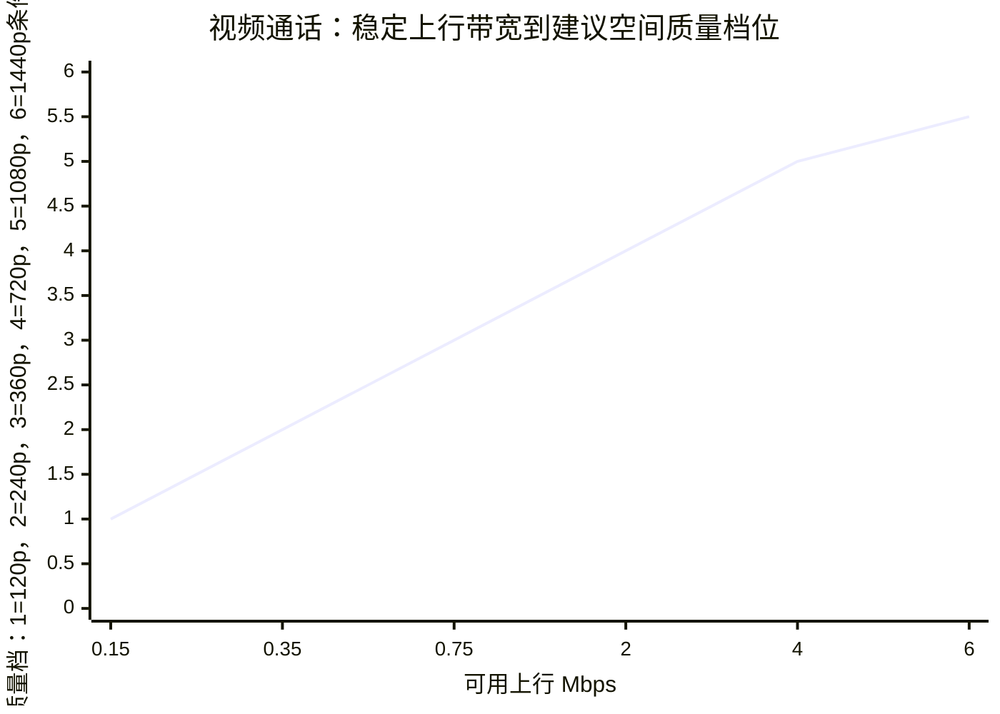
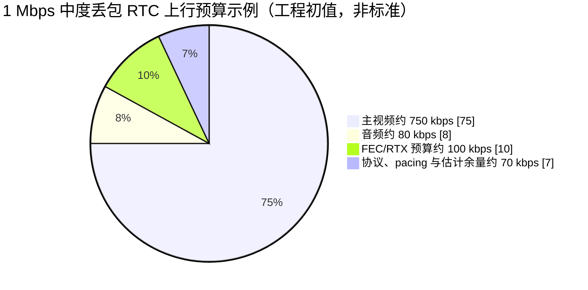
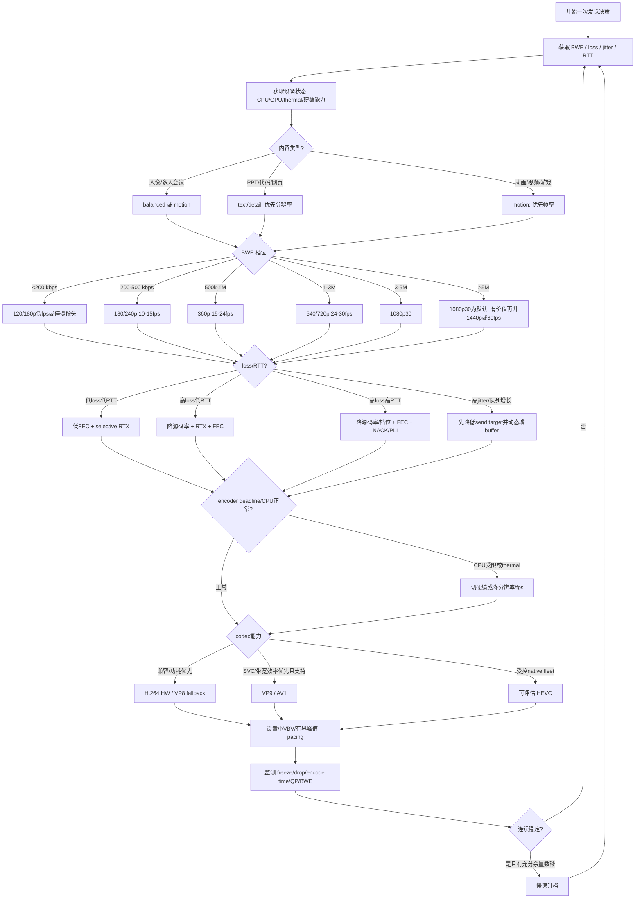

# 视频通话与屏幕共享场景下的视频参数自适应决策研究报告

## 执行摘要

视频通话与屏幕共享不存在一个跨网络、跨终端、跨内容都成立的“最佳分辨率/帧率/码率/编码器”组合。实时通信的正确问题不是“某个带宽该用几 p、几 fps”，而是：**在时变的可用带宽、丢包、RTT、抖动、编码算力与内容复杂度约束下，持续选择一个能最大化可感知质量、同时避免队列膨胀和交互延迟恶化的工作点。** IETF 对交互式实时媒体的要求明确强调低延迟、半可靠传输以及拥塞控制；3GPP 也要求发送端依据 RTCP/TMMBR 等反馈动态调整视频输出率，并在空间质量与时间分辨率之间维持平衡，而非维持固定的分辨率/码率。citeturn0search1turn0search0turn13view1

本研究得到的最重要结论如下。

| 结论 | 工程含义 | 结论性质 |
|---|---|---|
| **网络自适应应先控制“发送总负荷”，再决定分辨率和帧率** | 编码器目标码率应服从拥塞控制/BWE，而不能反过来让网络适应一个固定编码档位；降档要快，升档要保守 | 标准与工程实践均支持。citeturn0search1turn13view1 |
| **摄像头人像与文字屏幕共享的降级顺序应不同** | 人像/高动作优先保持时间连续性；文字、代码、PPT 优先保持空间分辨率与边缘清晰度。W3C 的 `contentHint="motion"` 对应优先帧率，`"detail"/"text"` 对应优先分辨率 | 已有明确规范。citeturn17search1 |
| **低 RTT 时 RTX 更有价值，高 RTT 时应更依赖 FEC、PLI/NACK 和编码器内部恢复** | 低 RTT+高丢包可用 RTX+FEC；高 RTT+高丢包则 FEC+Generic NACK 更合理；RTX 必须能在播放截止时间前到达 | 3GPP/RFC 有明确依据。citeturn13view0turn15search0 |
| **编码器选择不能只看“压缩率排名”** | AV1/VP9 通常在同码率下比 VP8 更高效，但编码复杂度、硬件支持、SVC 能力、端到端兼容性可能比单纯 VMAF 更重要；H.264 仍是跨终端非常稳健的基线 | 标准与近期 RTC 数据支持。citeturn1search0turn19search1turn19search7 |
| **硬件编码应成为移动端、1080p、多路编码以及 CPU 受限设备的优先路径，但不是无条件质量最优** | 硬编最大的确定收益是吞吐、功耗和 CPU 余量；相同码率下的视觉质量取决于具体硬件代际和参数，不宜笼统宣称“软编一定更清晰” | 官方 API 支持能力查询；不存在跨实现统一质量排序。citeturn17search0turn18search0turn17search2 |
| **CBR/VBR/CVBR 不是跨编码器语义完全相同的标准模式** | RTC 应追求“拥塞控制目标码率 + 小缓冲 + pacing + 有界峰值”；硬件低延迟编码常以 CBR/CBR-like 为稳健起点，Constrained VBR 可用于有峰值控制的场景，无约束 VBR 不适合作为实时默认 | NVIDIA 对视频会议等低延迟场景明确推荐 CBR 和很小的 VBV。citeturn17search2 |
| **不能用 PSNR/VMAF 单独代表 RTC 用户体验** | RTC 还必须测 freeze、frame drop、恢复时延、帧间隔抖动和交互延迟；最终应通过 ITU-T P.910 MOS 校准 | ITU、W3C 与 Microsoft RTC 研究均支持。citeturn16search0turn18search1turn7search6 |

一个实用的顶层控制规律是：

\[
B_{\text{primary video}} \le
B_{\text{BWE}}\times H
-B_{\text{audio}}
-B_{\text{repair}}
-B_{\text{protocol}}
\]

其中 \(H\) 是为估计误差与突发流量保留的 headroom。本报告建议稳定网络初始取 **0.85–0.90**，高抖动/高丢包时降至 **0.70–0.85**；这些具体数值属于本报告的**工程初始值，不是 IETF/3GPP 标准参数**。IETF 和 3GPP 能确认的是发送率必须服从拥塞信号，并且网络恶化时应快速降速、恢复时更谨慎。citeturn0search0turn21search2turn13view1

就视频通话的基础档位而言，本报告建议把 **<200 kbps、200–500 kbps、500 kbps–1 Mbps、1–3 Mbps、3–5 Mbps、>5 Mbps** 大致映射到 **120/180p、180/240p、360p、540/720p、1080p、1080p+高运动/1440p 条件档**。这是根据 Teams、Zoom、Tencent RTC 的公开工作点进行保守综合，而不是某个标准规定的固定映射：Teams 把视频最低需求列为约 150 kbps、1:1 推荐约 1.5 Mbps、最佳约 4 Mbps；Zoom 给出的 720p 1:1 推荐约 1.2 Mbps、1080p 约 3–3.8 Mbps；Tencent 的公开 Web profile 则给出 360p15≈800 kbps、720p15≈1.5 Mbps、1080p15≈2 Mbps、1440p30≈4.86 Mbps。citeturn22view0turn22view1turn24search1

屏幕共享则必须独立处理。对 PPT、IDE、Excel、网页等静态高细节内容，**宁可把 30 fps 降到 5–10 fps，也不要轻易把 1080p 文本降成 360p**；对电影、动画、游戏或高速滚动，则相反，应切换到 motion 策略并保持 24–30 fps。W3C 已把这种取舍直接编码进 `contentHint`/`degradationPreference`；Tencent 当前屏幕共享文档也以 720p/10fps/约 1.2–1.6 Mbps 为常规基线，并对大量文字内容给出 1080p/8fps/约 2 Mbps 的配置。citeturn17search1turn24search0turn24search2

## 研究目标、问题定义与证据边界

### 研究目标

本报告针对 Web、移动端和桌面原生 RTC，回答如下决策问题：

> 给定当前可用发送带宽 \(B\)、丢包率 \(L\)、抖动 \(J\)、RTT \(R\)、终端编码预算 \(C\) 和内容类型 \(S\)，应该怎样联合选择分辨率 \(W\times H\)、帧率 \(F\)、视频目标码率 \(V\)、编码器 \(E\)、软/硬件实现 \(I\)、码率控制模式 \(M\)、FEC/RTX 策略和播放缓冲 \(D\)，以最大化用户看到的 RTC 视频质量？

这个问题至少是一个多目标优化：

\[
\max Q_\mathrm{perceptual}
\]

同时约束：

\[
B_\mathrm{total}\le B_\mathrm{safe}
\]

\[
T_\mathrm{encode}+T_\mathrm{network}+T_\mathrm{jitter}
+T_\mathrm{decode}+T_\mathrm{render}
\le T_\mathrm{interactive}
\]

\[
T_\mathrm{RTX}<T_\mathrm{playout-deadline}
\]

以及：

\[
T_\mathrm{encode/frame}<1/F
\]

IETF 对 WebRTC/RTP 拥塞控制的核心要求正是交互性与低延迟，而 RFC 4588 特别指出，是否请求重传应考虑 RTT 与播放期限：即便一个包“可以修复”，若重传回来时已经过了播放 deadline，也没有用户价值。citeturn0search1turn15search0

因此，一个常见但错误的前提是：

> “只要可用带宽足够，尽可能增加分辨率、帧率和码率就能得到最佳效果。”

这不成立。编码器负荷可能首先成为限制因素；更高像素率还可能造成编码 deadline miss、CPU throttling、排队和帧丢弃。W3C 的 WebRTC Statistics API 因而分别暴露 `qualityLimitationReason = bandwidth/cpu/other`、编码帧率、编码分辨率、`totalEncodeTime`、`framesDropped`、`totalPacketSendDelay` 等指标，而不是把“网络带宽”视为唯一自变量。citeturn18search1

### 本报告如何区分事实与工程推断

以下三种结论需明确区分：

**标准/公开资料明确规定的事实。** 例如 WebRTC 基线要求实现 VP8 和 H.264 Constrained Baseline；W3C `text/detail` 内容提示优先保持分辨率；3GPP 建议低 RTT 高丢包使用 RTX+FEC。citeturn1search0turn17search1turn13view0

**厂商给出的经验工作点。** 例如 Teams、Zoom、Tencent 的“720p 需要多少带宽”等数字。它们非常适合作为初始 operating point，但不应理解为编码理论上的唯一最优解，因为不同产品可能采用不同编码器实现、SFU、抗丢包、内容分析和码率控制。citeturn22view0turn22view1turn24search1

**本报告的工程综合建议。** 例如把 2–5% loss 定义为“高丢包档”、将稳定网络的 headroom 设为 10–15%、把自适应 jitter-buffer 起始范围设为 40–80 ms。公开标准没有给出一个对所有 RTC 系统都最优的统一阈值，因此这些值应作为实验初始条件，而不能写死为产品常量。

### 公开证据存在的边界

需要特别指出几项公开资料没有给出明确结论：

**未找到明确结论：存在一套跨 H.264/VP8/VP9/AV1/HEVC、跨软件/硬件实现都成立的“编码效率固定排名”。** 编码器版本、preset、硬件代际、内容、分辨率、延迟约束和 rate control 都会改变结果。Microsoft VCD 本身就是因为传统高质量视频数据集不足以代表视频会议而建立，说明“素材分布”本身会改变 codec 评估。citeturn19search1turn19search9

**未找到明确结论：BBR-like 拥塞控制在 WebRTC 视频上普遍优于 GCC。** BBR 的核心是从 bottleneck bandwidth 与传播 RTT 构建传输模型，而公开 WebRTC/RMCAT 体系的 GCC、NADA、SCReAM 是直接面向实时媒体的算法；当前没有 IETF 标准规定用 BBR 取代 WebRTC 媒体拥塞控制。citeturn18search3turn0search3turn21search2

**未找到明确结论：一个适用于所有视频 RTC 的固定 jitter-buffer 数值。** 缓冲越大越能吸收抖动，却必然增加 playout latency；因此它本质上需要自适应，而不能仅依据“平均 jitter”选一个永久常数。RFC 3550 的 jitter 本身也是 RTP 包间隔变化的统计量，对视频还可能包含发送调度特征，不应简单等同于“纯网络抖动”。citeturn14search1

**未找到明确结论：Zoom、WeChat/微信以及 Google Meet 当前生产系统全部内部 codec/BWE/FEC 决策阈值。** 这些属于产品实现细节；可以获得官方带宽建议和部分公开算法/论文，但不能据此反推出完整生产算法。GCC 的公开 IETF 文档本身也是过期 Internet-Draft，因此本报告只把它用于解释 GCC 的公开算法思想，并结合 RFC 8888 与学术论文，不把该 draft 当作现行标准。citeturn0search2turn18search2turn0search0

## 决策维度与核心机制

### 网络指标不能独立使用

可用带宽、packet loss、jitter 和 RTT 的意义不同：

| 指标 | 它真正回答的问题 | 对参数决策的首要影响 |
|---|---|---|
| 可用发送带宽/BWE | 现在不造成持续拥塞大约能发送多少数据 | 决定总媒体预算、空间层上限 |
| 丢包率 | 已发送数据有多少需要恢复或会造成参考链损坏 | FEC/RTX、码率余量、关键帧/刷新策略 |
| 抖动 | 包到达节奏是否稳定 | jitter buffer、播放 deadline、pacing |
| RTT | 一次反馈或重传循环有多慢 | 决定 RTX 是否还有时间价值 |
| 排队延迟趋势 | 网络是否正开始拥塞，即使尚未丢包 | GCC/SCReAM 等提前降速 |
| 编码端发送队列 | 编码突发是否超出 transport 消化能力 | CBR/CVBR、pacer、关键帧峰值限制 |

RFC 8888 的 transport feedback 正是为了让拥塞控制获得每包序号、到达时间、丢包/ECN 等信息；GCC、NADA、SCReAM 等算法都可建立在此类更细粒度反馈之上。citeturn0search0

为了把网络状态转成工程决策，本报告采用下面的**保守分档**。这些不是标准阈值，而是建议的控制器初始化区间：

| 状态 | 低 | 中 | 高 | 严重 |
|---|---:|---:|---:|---:|
| 丢包 | <0.5% | 0.5–2% | 2–5% | >5% |
| jitter | <15 ms | 15–30 ms | 30–60 ms | >60 ms |
| RTT | <100 ms | 100–200 ms | 200–400 ms | >400 ms |

这里故意比厂商“判定为 poor”的阈值严格。Microsoft CQD 例如把音频流的平均 jitter >30 ms、loss >10%、RTT >500 ms 作为 poor-stream 分类条件，但 Microsoft 明确说明这些是诊断分类阈值，并不等同于“超过之前一定无感、超过之后一定有问题”；因此拿 10% loss 当成视频码控的安全目标会过于宽松。citeturn16search2turn16search6

ITU-T G.114 则指出，网络规划一般不应超过 400 ms 单向时延，而且视频会议等高度交互业务在远低于该值时就可能受到影响。因此，本报告将 RTT 200–400 ms 已视为明显不利于 RTX 的区域，而不是等到 RTT 800 ms 才处理。citeturn21search1

### 场景类型决定“先牺牲什么”

对于摄像头人像、多人会议和高动作视频，更明显的时间抽动往往比一定程度的空间软化更破坏自然度，因此低带宽时通常应先降低空间分辨率，保持至少约 15 fps；电影、体育或游戏则进一步偏向 24–30 fps。对文字/代码/PPT，降采样会直接破坏笔画和小字可读性，因此应先降帧率。W3C Content Hints 把这种语义明确标准化：`motion` 应优先保持 frame rate，`detail` 和 `text` 应优先保持 resolution。citeturn17search1

因此建议：

| 内容 | 优先级 | 首选降级顺序 |
|---|---|---|
| 单人人像 | 面部结构 + 连续运动 | 码率 → 轻度降分辨率 → 30→24/15 fps |
| 多人宫格 | 每个 tile 像素数本来较少 | 降单层分辨率/订阅层 → 降 fps |
| 高动作摄像头 | 时间连续性 | 分辨率 → 码率/量化 → 最后降 fps |
| PPT/IDE/网页/表格 | 文本和边缘可读性 | fps → 编码量化 → 最后才明显降分辨率 |
| 滚动/动画 | 清晰度与连续性平衡 | balanced |
| 视频播放/游戏分享 | 连续运动 | 分辨率 → 保持 24/30 fps |

这也是为什么“720p30 总比 1080p10 好”或“1080p 总比 720p 好”都不是成立的普遍命题。citeturn17search1

### 带宽估计与码率控制应分层

比较合适的控制结构不是让 codec 自己“猜网络”，而是：

```text
Transport feedback
      ↓
Congestion controller / BWE
      ↓
可安全发送总码率
      ↓
音频/视频/修复流预算
      ↓
视频码率控制器
      ↓
分辨率 / FPS / QP / layer
```

GCC 的公开设计结合 delay-based 与 loss-based 控制；其学术分析描述了基于单向时延变化/趋势来判断 overuse 并调整发送率的方案。需要再次强调：公开 GCC Internet-Draft 已过期，现代 libwebrtc 实现已经演化，所以不能把 draft 中的全部常量当成 2026 年 Chrome 的生产参数。citeturn18search2turn0search2

| 算法族 | 主要拥塞信号 | RTC 优点 | 风险/边界 |
|---|---|---|---|
| GCC 类 | delay trend + loss + receiver feedback | 成熟 RTC 思路；能在 loss 发生前通过排队趋势响应 | 具体生产实现不断演化；公开 draft 不是标准。citeturn18search2turn0search2 |
| NADA | 聚合 delay/loss/ECN 拥塞信号 | 专门面向实时媒体 | RFC 为 Experimental。citeturn0search3 |
| SCReAM | self-clocked cwnd + delay/loss | 明确目标是低队列、低延迟，且考虑编码器输出不是严格 CBR | RFC 8298 为 Experimental。citeturn21search2 |
| BBR-like | bottleneck bandwidth + min/propagation RTT 模型 | 对模型化容量、避免传统 loss-only 控制有启发 | 原始 BBR 是通用传输拥塞控制，并非 RTC 视频参数控制标准；**未找到其普遍胜过 GCC 的明确结论**。citeturn18search3 |

从 RTC 参数控制角度，本报告建议：

\[
B_\mathrm{encoder,target}
=
\min(B_\mathrm{app,max},
B_\mathrm{device,max},
H\times B_\mathrm{BWE})
\]

并使用明显的 hysteresis：**降档快、升档慢**。3GPP 对视频 rate adaptation 也明确要求根据反馈调整发送率，并把网络变差时的下调与网络恢复后的谨慎上调区分开来。citeturn13view1

可以把以下数值作为实验初值，而非标准：

| 行为 | 建议初值 |
|---|---|
| 网络容量下降 | 持续 0.3–1 s 出现 overuse/loss/queue growth 即降档 |
| 网络容量恢复 | 至少稳定 3–10 s，再升空间层 |
| 升档余量 | 新档目标码率最好低于 BWE 的约 75–85% |
| 同一档内部 | 先连续调 target bitrate/QP，再跨 resolution/fps 档 |
| 分辨率切换 | 加 hysteresis，避免 360p↔720p 高频震荡 |

具体时间和百分比没有公开标准统一规定，应通过产品网络 trace 调优。

### CBR、VBR 与 Constrained VBR

这里有一个概念需要纠正：**CBR、VBR、Constrained VBR 是编码器 rate-control 行为，不是 H.264/VP9/AV1 本身的统一网络模式**；不同软件库和硬件 SDK 对 buffer、peak、VBV、lookahead 的定义可能不同。

对于交互 RTC：

| 模式 | 视频通话 | 静态屏幕 | 高动作屏幕 | 判断 |
|---|---|---|---|---|
| Strict/near CBR | **推荐** | 可用 | **推荐** | 最容易保持小发送队列和可预测 pacing |
| Constrained VBR / capped VBR | 可用 | **很适合实验** | 可用但必须严格 peak cap | 可利用内容复杂度变化，但防止 slide/keyframe 突发 |
| Unconstrained VBR | 不推荐 | 不推荐 | 不推荐 | 突发帧可能建立网络队列 |
| Constant QP | 不适合作为公网 RTC 默认 | 仅测试 | 不推荐 | 无法根据网络容量控制输出大小 |

NVIDIA 当前 NVENC 指南针对 video conferencing、game streaming 等低延迟场景明确推荐 low/ultra-low-latency tuning、**CBR、极小 VBV buffer**；而 VBR 和大缓冲则更多用于 recording/archive。其文档也指出 lookahead 会缓存未来帧，因此增加编码延迟。citeturn17search2

因此“Constrained VBR 一定比 CBR 清晰”也不是可靠结论。更准确的策略是：**先保证 transport pacing 和 peak bound，再讨论 encoder 内部是否允许一定的 frame-to-frame VBR。**

### FEC、ARQ/RTX 与错误恢复应根据 RTT 联合决策

3GPP Release 18 给出的方向非常实用：

| 网络情况 | 优先恢复策略 |
|---|---|
| 低 RTT + 低 loss | selective RTX；不必大量 FEC |
| 低 RTT + 较高 loss | RTX + FEC |
| 高 RTT + 较高 loss | FEC + Generic NACK；RTX 的 deadline 风险上升 |
| 高 RTT + 低/中 loss | FEC/编码恢复 + NACK/PLI，谨慎 RTX |
| burst loss | FEC + intra-refresh/参考链恢复 |
| 参考链已经失效 | PLI/FIR → encoder refresh/keyframe |

这是标准资料中最值得直接落地的部分。3GPP 同时指出 FEC 会增加码率，因此应与 rate adaptation 联动，避免“原视频码率不变，再额外叠加 FEC”导致总发送率反而把网络推入更深拥塞。citeturn13view0turn12view2

RFC 4585 定义了 Generic NACK 与 PLI；PLI 的含义本质上是接收端发现预测链可能已破坏，可以请求发送端恢复图像，但发送端仍应服从拥塞控制，不能因大量 PLI 无限制地产生 I 帧。citeturn14search0

RFC 5109 的 parity FEC 支持不同保护长度、保护级别和 group size，因此理论上可以做不等保护，例如对关键参考数据比 enhancement 数据给予更强保护。citeturn14search2

### jitter buffer 应解决抖动，而不是掩盖持续拥塞

固定增加 buffer 能减少 late-frame，却以交互时延为代价。因此推荐 adaptive playout：

| 网络状态 | 视频 playout-buffer 实验初值 | 策略 |
|---|---:|---|
| jitter <15 ms | 40–80 ms | 优先低延迟 |
| 15–30 ms | 60–120 ms | 根据 late-frame 率动态调整 |
| 30–60 ms | 100–180 ms | 同时降源发送率，避免单纯扩 buffer |
| >60 ms | 150–250 ms 上限区间 | 若仍持续，降 fps/分辨率；不能无限增大 |

**这些毫秒数是实验起点，未找到公开标准给出跨平台“最佳视频 jitter buffer”固定值。** RFC 3550 提供 jitter 的定义，却没有规定 RTC 视频必须采用某个具体 buffer；实际控制应同时观察 late frames、freeze 和 end-to-end latency。citeturn14search1turn18search1

### 可感知质量不能只看编码失真

| 指标 | 衡量内容 | 优点 | RTC 盲区 |
|---|---|---|---|
| PSNR | 像素误差 | 简单、可重复 | 与人眼感知不总一致；对 freeze/交互延迟弱 |
| SSIM | 结构相似度 | 比纯像素误差更关注结构 | 原始 SSIM 更偏图像级，不完整反映 RTC temporal QoE |
| VMAF | 多特征融合的感知质量 | 更接近视觉主观评分，编码器测试常用 | 对 freeze、卡顿、交互时延仍需额外 temporal 特征 |
| MOS | 人类主观感知 | 最接近最终目标 | 成本高、实验设计必须规范 |
| RTC temporal metrics | freeze、drop、inter-frame delay 等 | 能捕获“编码画面不错但不断卡”的问题 | 单独使用又不能衡量清晰度 |

SSIM 的原始工作明确从“误差可见度”转向结构信息相似度。citeturn16search3 Netflix 的 VMAF 是多方法融合的感知视频质量指标，其官方实现同时提供 PSNR、SSIM 等指标。citeturn16search1 ITU-T P.910 是多媒体视频主观质量评估的正式 Recommendation，2026 年已有新的 P.910 版本。citeturn16search0turn16search4

RTC 特别需要 temporal metrics。W3C Stats 提供 `framesDropped`、`freezeCount`、`totalFreezesDuration`、帧间延迟及方差、RTT、loss、encoder time 等指标；Microsoft 的 Video Call MOS 工作也把 VMAF 与 freeze 等时间失真特征结合起来，这比仅以编码 PSNR 作为产品 QoE 优化目标更合理。citeturn18search1turn7search6

## 编码器、软硬件与平台选择

### 主流编码器的现实取舍

WebRTC 的一个关键兼容性事实是：RFC 7742 要求 WebRTC 端点实现 VP8 和 H.264 Constrained Baseline，因此 H.264/VP8 是最稳健的 WebRTC 基线；VP9、AV1、HEVC 虽各有优势，但不属于该 RFC 的双 mandatory baseline。citeturn1search0

| 编码器 | 同码率效率的工程判断 | 实时编码复杂度 | 可伸缩编码 | 兼容性/硬件 | 最合适场景 | 主要短板 |
|---|---|---|---|---|---|---|
| **H.264/AVC** | 中 | 低–中 | 常见 WebRTC 使用以 temporal/simulcast 为主 | **非常强**；WebRTC mandatory baseline | 移动端、电池敏感、异构终端、兼容性优先 | 同码率效率通常落后于较新的 VP9/AV1；常见部署的 spatial SVC 灵活性有限。citeturn1search0turn1search1turn21search0 |
| **VP8** | 中/偏低 | 低–中 | temporal scalability；simulcast 成熟 | WebRTC mandatory，硬件路径依设备/UA | 兼容、简单、多方会议保守基线 | 近期同一 RTC 数据集实验中明显落后 VP9/AV1 的编码效率。citeturn1search0turn19search7 |
| **VP9** | 高 | 中–高 | **较强 spatial + temporal SVC** | Web 环境较好；硬件 encode 需运行时确认 | SFU 多方、低码率 HD、可伸缩会议 | 软件编码 CPU 比 H.264 基线更吃紧；不同平台硬件覆盖不一致。VP9 RTP 已于 2025 年标准化为 RFC 9628。citeturn4view1turn21search0 |
| **AV1** | **高/很高** | 高，尤其软编 | **很强**；原生设计支持 temporal/spatial scalability | 新设备硬件支持快速增加，但不能假设所有端点均有 | 带宽贵、多层 SFU、高质量屏幕/会议、有 AV1 硬编设备 | 低端设备软编成本可能抵消码率收益，必须检测能力。citeturn5search0turn21search0 |
| **HEVC/H.265** | 高 | 中–高 | 支持 temporal scalability；RTP 标准化 | Apple/原生硬件生态常有优势，但 WebRTC 跨浏览器不能当 mandatory 能力 | 受控原生客户端、Apple-heavy fleet、高分辨率内容 | WebRTC 互通、部署和许可生态比 H.264 baseline 更复杂。citeturn2search1turn21search0 |

这里的“高/中”是**工程相对判断而非编码标准承诺**。实际 codec 比较必须锁定 encoder implementation、preset、latency 和 rate control。

近期一项基于 Microsoft VCD、使用 libWebRTC codec harness 的 2026 测试提供了一个很有参考价值但不能过度泛化的结果：在 180p/150 kbps、360p/500 kbps、720p/2.5 Mbps、1080p/4 Mbps 这些工作点上，VP9/AV1 对 VP8 的 PSNR/VMAF 优势比较稳定，而 VP9 与 AV1 两者谁领先会随分辨率、内容和指标变化；这正说明不能把 AV1 与 VP9 排成永不变化的绝对顺序。该测试使用的源数据来自 Microsoft 专门为视频会议建立的 VCD。citeturn19search7turn19search1

更值得注意的是，同一个近期测试中 AV1 软件编码的耗时高于 VP8/VP9/OpenH264；该数字只代表特定 libWebRTC harness、线程数和实现，**不能拿来证明任意硬件上的 AV1 都更慢**。citeturn19search7

### 多人会议优先考虑可伸缩性，而不只是单流效率

对 SFU 多人会议，编码器的一项核心价值是能否提供不同空间/时间层，让服务器为不同订阅者转发不同质量，而不是让发送端为每个接收者单独转码。W3C WebRTC SVC 扩展定义了诸如 `L1T2`、`L1T3`、`L2T3`、`L3T3` 等 scalability modes，并说明 VP9、AV1 可以支持空间和时间伸缩，而 VP8、H.264、H.265 在该 API 语境下主要提供时间伸缩/多 SSRC simulcast 能力。citeturn21search0

因此，**多人会议中 AV1/VP9 的价值不只是“省 20% 码率”这类单一指标，而在于 SVC layer 可以同时降低 SFU 下行适配成本和频繁关键帧切换的需求。**具体节省比例则没有统一答案。

推荐的通用 SFU ladder 可以从：

```text
低层：180p / 7.5–15 fps
中层：360p / 15–30 fps
高层：720p / 30 fps
```

开始验证。1080p 高层只应在主讲/大画面和足够下行条件下启用；宫格里的小 tile 即使接收 1080p，用户通常也无法获得与成本相称的空间质量收益。这一具体 ladder 是本报告的工程建议，而非 W3C 标准。

### 软件编码还是硬件编码

不能把“软件编码 = 高质量、硬件编码 = 低质量”当成事实。现代硬件编码器同样具有 AQ、intra refresh、LTR、SVC/temporal layers、动态 reconfigure 等复杂工具；NVENC 例如可在不中止 session 的情况下调整 bitrate、frame rate、resolution，并提供适合 video conferencing 的 low-latency 配置。citeturn17search2

建议决策如下：

| 条件 | 软编优先 | 硬编优先 |
|---|---|---|
| 180/360p 单路 | ✓ 若 CPU 富余且新 codec 的效率收益明显 | 也可 |
| 720p30 | 视设备 | **通常优先** |
| 1080p30+ | 仅高性能桌面 CPU | **强烈优先** |
| Simulcast 多路 | CPU 很容易成为瓶颈 | **优先** |
| 移动端/笔记本电池 | 不理想 | **优先** |
| AV1 无硬编、带宽极紧 | 可在高性能桌面尝试 AV1 soft | H.264/VP9 HW 往往是更稳妥整体选择 |
| 高温/thermal throttling | 避免 | **优先** |
| 需要极特定软件 encoder tool | **软编可能更可控** | 视 SDK 功能 |

对于 Web，应用通常不应假设自己能稳定“强制 NVENC/软件 x264”。正确做法是**运行时能力探测 + stats 验证**。W3C 的 Media Capabilities/SVC API 可以查询配置是否 supported/smooth/power-efficient；WebRTC stats 还定义了 `encoderImplementation` 与 `powerEfficientEncoder`，尽管浏览器基于隐私策略可能限制这些硬件信息。citeturn21search0turn18search1

### 各平台落地建议

| 平台 | 能力发现 | 默认策略 | 编码器建议 |
|---|---|---|---|
| Web/Browser | `RTCRtpSender.getCapabilities()`、MediaCapabilities、`getStats()` | 不假设实际 HW/SW 路径；动态观察 CPU/bandwidth limitation | H.264/VP8 保底；VP9/AV1 可用则优先测试；HEVC 必须 runtime probe。WebRTC baseline 仍是 H.264/VP8。citeturn1search0turn21search0 |
| Android Native | `MediaCodecList/MediaCodecInfo`；Android API 提供 `isHardwareAccelerated()` 和 `isSoftwareOnly()` | 720p+ 或电池敏感优先硬编 | 按设备实际 H.264/HEVC/VP9/AV1 capability 选择，不能仅按 OS 版本假设。citeturn17search0 |
| iOS/macOS Native | VideoToolbox | 优先系统硬件路径，必要时根据 capability fallback | Apple 明确将 VideoToolbox 定位为访问硬件加速 encode/decode 的低层框架，并提供低延迟会议编码接口。citeturn18search0 |
| Windows/Linux Native | OS/厂商 codec API | 高分辨率、多路、屏幕游戏分享优先 HW | 例如 NVENC 当前支持低延迟 H.264/HEVC/AV1 路径和动态 reconfigure。具体 Intel/AMD/NVIDIA 能力应运行时枚举。citeturn17search2 |

一个非常实用的运行时软硬编切换信号是：

\[
\frac{\Delta totalEncodeTime}
     {\Delta framesEncoded}
\]

与 frame interval 相比。例如 30 fps 的 interval 是 33.3 ms；本报告建议当编码耗时长期超过 frame interval 的约 **50–70%**，同时出现 `qualityLimitationReason=cpu`、capture→encode frame drop 或 thermal throttling 时，就应降低复杂度、降分辨率/fps 或切到硬件编码。50–70% 是工程安全余量，不是 W3C 标准；W3C 定义的是这些统计量本身。citeturn18search1

## 网络分档、参数推荐与快速参考

### 视频通话基础工作点

以下表格是本报告最核心的工程推荐。**“可用带宽”指拥塞控制估算出的稳定上行容量，而“视频码率”指 primary video payload 的目标范围，不包括音频、FEC/RTX 和协议/安全余量。** 档位锚点综合 Teams、Zoom 与 Tencent RTC 的公开配置；中间值及降级逻辑属于本报告综合，而不是任何一家厂商的固定生产算法。citeturn22view0turn22view1turn24search1

| 稳定可用上行 | 人像基础分辨率 | fps | 主视频目标码率 | 首选 codec | 编码模式 | 典型策略 |
|---|---|---:|---:|---|---|---|
| **<200 kbps** | 160×90～160×120；必要时停视频 | 7.5–12/15 | 60–130 kbps | H.264/VP8；AV1 仅在已验证高效实现 | CBR-like | 首先保证音频；高 loss 时与其产生严重 freeze，不如降至极低帧率/暂停摄像头 |
| **200–500 kbps** | 320×180 / 320×240 | 10–15 | 160–350 kbps | H.264/VP8；VP9/AV1 有能力可试 | CBR/CVBR capped | 保持面部连续性，不追求 360p30 |
| **500 kbps–1 Mbps** | 640×360，复杂人像可 480p15 | 15–24 | 400–800 kbps | VP9/AV1 效率优先；H.264 HW 性能优先 | CBR-like | 这是 360p 的稳健区域；高 motion 宁可 360p24 而不是 720p10 |
| **1–3 Mbps** | 540p～720p | 24–30 | 0.9–2.2 Mbps | H.264 HW / VP9 / AV1 | CBR/CVBR capped | 普通视频会议的主要“甜点区”；720p30 通常足够 |
| **3–5 Mbps** | 1080p | 30 | 2.5–4 Mbps | H.264 HW / VP9 / AV1 / HEVC controlled fleet | CBR-like | 主讲人大画面、高质量 1:1；多人小 tile 未必需要 1080p |
| **>5 Mbps** | 1080p30 默认；特殊场景 1440p30 或 720/1080p60 | 30，motion 可 60 | 3.5–6+ Mbps | AV1/VP9/HW H.264/HEVC | CBR/CVBR capped | 不应“有多少带宽花多少”；多出的预算优先用于 resilience/headroom，只有大屏高运动确有价值时才升档 |

Tencent Web profile 提供了很接近上述中间锚点的一组公开参数：320×180/15fps/350 kbps、640×360/15fps/800 kbps、720p15/1.5 Mbps、1080p15/2 Mbps、1440p30/4.86 Mbps。citeturn24search1 Zoom 则给出 1:1 720p 约 1.2 Mbps、1080p 约 3.8/3.0 Mbps；Teams 给出视频最低约 150 kbps、1:1 推荐约 1.5 Mbps、最佳约 4 Mbps，并指出在带宽允许时可达到 1080p30。citeturn22view1turn22view0

这些数字之间有差异恰恰说明：**“720p 必须 1.5 Mbps”不是自然规律。** 内容复杂度、fps、codec、摄像头噪声、背景虚化、encoder preset 都会改变实际 rate-quality curve。Microsoft VCD 研究也指出不同视频会议场景会显著影响各编码器的 compression efficiency。citeturn19search9

### 网络恶化后的修正系数

不要只根据带宽档位选参数；同样的 2 Mbps，在 0% loss/20 ms RTT 和 5% loss/350 ms RTT 下应做完全不同的决策。

| 状态 | 视频 target 调整 | 分辨率/fps | FEC/RTX | buffer |
|---|---|---|---|---|
| loss <0.5%，RTT <100 ms，jitter <15 ms | BWE 的约 85–90% 可用于总媒体预算 | 保持基础档 | FEC 可很低；selective RTX | 低 |
| loss 0.5–2% | 保留约 10–15% headroom | 通常暂不跨档 | 低 RTT 可 selective RTX；轻量 FEC | 小幅增加 |
| loss 2–5% | 源视频先降约 10–25% | 高 motion 先降 resolution；detail 先降 fps | 低 RTT：RTX+FEC；高 RTT：FEC+NACK/PLI | 中 |
| loss >5% | 至少降低一个工作档；避免关键帧 burst | 必要时 30→15fps / 720→360p | 强化 FEC/编码恢复；RTX 仅 deadline 允许 | 中高 |
| RTT >200 ms | source rate 更保守 | 避免频繁层切换 | 降低对 RTX 的依赖 | 不应单纯无限扩大 |
| RTT >400 ms | 交互已经明显困难 | 保持低队列比高清更重要 | 主要依赖 FEC/PLI/intra refresh | 严格控制总 E2E 延迟 |
| jitter >30 ms 且 queue 上升 | **首先降发送率** | 必要时降档 | recovery 次要于消除 congestion | 动态增加 |
| burst loss | 保持总发送预算 | 避免大 IDR flood | FEC + gradual intra refresh/LTR 可测试 | 按 late-frame 调 |

其中“10–25% headroom”等百分比为**本报告测试初值**。恢复模式的方向则有 3GPP/RFC 支持：FEC 在高延迟和中度损失中有价值；低 RTT/高 loss 可结合 RTX+FEC；高 RTT/高 loss 应更多使用 FEC+NACK；所有修复数据仍必须计入拥塞控制总预算。citeturn13view0turn15search0

### 带宽到质量档位的工程曲线

下面不是 VMAF 实测曲线，而是上述推荐表的**操作档位曲线**；纵轴是相对档位，不应解读为“质量线性增长”。



关键特征是**边际收益递减**：从 200 kbps 增加到 1–2 Mbps 往往能跨越多个明显可见的空间质量档；而从 4 Mbps 增加到 6 Mbps，在普通 talking-head 会议里未必值得从 1080p30 继续提升。Teams 的最佳性能档即约 4 Mbps/endpoint、最高约 1080p30；Tencent 虽提供约 4.86 Mbps 的 1440p30 profile，但这不意味着所有通话都应使用它。citeturn22view0turn24search1

### 码率预算示例

对于一个 **BWE≈1 Mbps、中度丢包、普通人像** 的连接，一个合理的初始预算不是“视频编码器直接设 1 Mbps”，而可以先按下面的实验模板分配：



这张图表达的是**控制思想，不是固定比例**。尤其 FEC/RTX 应按实时 loss、burstiness 和 RTT 动态增减；3GPP 明确指出增加 FEC 时应通过 rate adaptation 控制总发送率，而不能让保护流把总 bitrate 推高。citeturn13view0

### 参数快速参考

| 场景 | 分辨率 | fps | 典型主视频码率 | 降级偏好 | codec 首选原则 |
|---|---|---:|---:|---|---|
| 极差网络人像 | 120/180p | 7.5–15 | 80–250 kbps | 音频第一 | 最轻量、最可靠实现 |
| 普通弱网人像 | 240/360p | 15 | 250–700 kbps | balanced/motion | H.264 HW；VP9/AV1 算力允许则试 |
| 标准会议 | 360/720p | 24–30 | 0.6–2 Mbps | balanced | H.264/VP9/AV1 |
| 高清 1:1 | 720/1080p | 30 | 1.5–4 Mbps | balanced | 高效 codec 或 HW H.264 |
| 多人 SFU | 180/360/720 layers | 7.5–30 | 总约 1–3 Mbps 起测 | layer adaptation | VP9/AV1 SVC 或 H.264/VP8 simulcast |
| 静态屏幕 | 720/1080p | 3–10 | 低变化时可远低于峰值；峰值约 1–2 Mbps 常见 | maintain-resolution | detail/text optimized |
| 滚动屏幕 | 720p | 10–15 | 0.8–1.6 Mbps | balanced | VP9/AV1/H.264 HW |
| 动画 | 720p | 15–30 | 1.2–2.5 Mbps | balanced/motion | 高效 codec |
| 视频/游戏共享 | 720/1080p | 30；条件好可 60 | 1.5–5+ Mbps | maintain-framerate | AV1/VP9/HW H.264/HEVC controlled fleet |

## 屏幕共享专项

### 静态内容与动态内容不能使用同一 profile

屏幕共享最大的错误之一是把它当“另一台摄像头”。

静态 PPT、代码编辑器和网页有大量**完全不变的像素、高对比边缘、小字号文本和平坦色块**；电影和游戏则具有连续运动。W3C 因而明确区分 `detail/text` 和 `motion`，并指出若错误地对高细节内容大幅 downscale，小文本可能直接失去可读性。citeturn17search1

Tencent 的当前屏幕共享文档同样说明屏幕内容通常变化不大，因此推荐约 10 fps，而非默认追求 30 fps；其移动端常规建议为 1280×720/10fps/约 1.2 Mbps，另一份 Flutter 文档给出常规 720p10/1.6 Mbps、文本教学 1080p8/2 Mbps，并强调这里的 bitrate 是画面变化大时的最高输出水平，静态时实际编码率会更低。citeturn24search0turn24search2

Teams 的数据从另一个角度印证这种差异：最低屏幕共享帧率可以自适应到约 1.875–7.5 fps，推荐条件下约 7.5–30 fps；高运动内容才更需要 15–30 fps。citeturn22view0 Zoom 甚至给出“只有屏幕共享、无摄像头缩略图”的推荐带宽约 50–75 kbps，这显然更接近静态/低变化内容的平均网络消耗，而不能拿它推导“1080p 动画只要 75 kbps”。citeturn22view1

### 屏幕共享推荐参数

| 内容类型 | 分辨率 | fps | 目标/峰值码率建议 | Web hint | 降级模式 | codec 建议 |
|---|---|---:|---:|---|---|---|
| **PPT/静态文档** | 1080p 优先；弱网至少尽量保 720p | 3–8 | 平均可能数十～数百 kbps；变化峰值预留 1–2 Mbps | `text` / `detail` | `maintain-resolution` | AV1/VP9 效率优先；H.264 HW 兼容优先 |
| **IDE/Excel/网页** | 1080p；字体足够大时可 720p | 5–10 | 0.4–1.5 Mbps，按 dirty area 波动 | `text` | `maintain-resolution` | 同上 |
| **光标+轻滚动** | 720/1080p | 10–15 | 0.8–1.6 Mbps | `detail`→必要时 `motion` | balanced | VP9/AV1/H.264 |
| **连续滚动/动画** | 720p 起 | 15–30 | 1.2–2.5 Mbps | `motion` | balanced/maintain-framerate | VP9/AV1 或 HW H.264 |
| **视频播放** | 720p/1080p | 24–30 | 1.5–5 Mbps | `motion` | maintain-framerate | AV1/VP9；HW H.264/HEVC controlled fleet |
| **游戏/高动作** | 优先 720p30/60，再升 1080p | 30–60 | 2–6+ Mbps | `motion` | maintain-framerate | 低延迟硬编优先 |
| **超弱网上的文字** | 尽量 720p | 1–5 | 100–500 kbps 平均，严格限制 slide-change burst | `text` | maintain-resolution | 低 fps 比 360p 高频帧更合理 |

这里最重要的是区分**长期平均码率**和**瞬时峰值**。屏幕保持不变时，帧间预测可以使输出非常小；一旦翻页或整个窗口滚动，大量像素同时改变，单帧可能突然很大。W3C WebRTC Stats 甚至定义了 `hugeFramesSent`，将明显大于正常目标帧大小的帧单独统计，并指出这可以用于识别 presentation slide-change 一类事件。citeturn18search1

### ROI 与区域编码

屏幕编码中，ROI 的优先级可以设计为：

```text
文本输入/当前编辑区域
        ↓
光标附近
        ↓
活动窗口
        ↓
发生变化的 dirty rectangles
        ↓
静态背景
```

但需要区分三件常被混为一谈的技术：

**捕获区域裁剪**：只 capture/分享一个窗口或区域，直接减少输入像素。

**变化区域检测**：检测 dirty region，降低 capture/copy/分析成本，并可以决定是否需要生成新帧。

**编码器 ROI/QP map**：在同一帧内对重要区域使用更低 QP。

这三者不是一回事。

3GPP 提供 ROI 信令机制；一些硬件编码器也暴露更底层的区域质量控制。例如 NVENC 的 emphasis map 可按 macroblock 调整 QP，使指定区域获得更高质量，但 NVIDIA 同时警告这种操作发生在 rate control 之后，因此可能导致 VBV/rate violation。citeturn12view0turn17search2

因此，对公网 RTC 最重要的约束仍然是：

\[
\text{ROI enhancement}
\neq
\text{permission to exceed congestion budget}
\]

也就是说，文字 ROI 多拿到的 bits 应从非重要区域重新分配，而不是在网络已满时额外增加总码率。

在浏览器 WebRTC 中，应用层能够较稳定表达的是 `contentHint=text/detail/motion`；**未找到 Web 标准允许普通应用统一向所有浏览器直接提供任意 encoder QP ROI map 的结论**。因此 Web 应优先依赖 content hint、裁剪和浏览器内部 content-aware coding；Native SDK 才适合做更细的 ROI/dirty-region 管线。citeturn17search1

### 帧差与“没有变化就不要硬发 30 fps”

对静态桌面，一个 30 fps capture clock 不应自动意味着每秒必须生成 30 个高成本编码帧。更好的实现是：

1. capture 层检测是否有有效变化；
2. 没变化时降低实际 frame emission cadence；
3. 光标等小范围变化时允许轻量 delta frame；
4. 大区域变化时临时提升 fps/bit allocation；
5. 持续运动超过阈值时切到 motion profile。

Tencent 屏幕共享在 pause 状态甚至明确采用最后一帧约 1 fps 输出；其常规共享只推荐约 10 fps，也说明“固定高 fps”并不是静态屏幕质量的必要条件。citeturn24search2turn24search0

### 关键帧不应成为默认丢包修复工具

屏幕内容突然翻页时发送 IDR/keyframe 看起来直观，但 I 帧可能产生巨大 burst；如果拥塞正是问题，大量 PLI→大量 keyframe 会形成恶性循环。

推荐区分：

| 事件 | 处理 |
|---|---|
| 开始共享 | 发送可独立解码的起始帧 |
| 新订阅者加入 | 按 SFU/decoder requirement 请求 refresh/keyframe |
| 收到有效 PLI/FIR | refresh，但服从拥塞控制 |
| 单个普通 packet loss | 优先 NACK/RTX/FEC，不自动全帧 IDR |
| 持续丢包 | intra refresh/GDR/LTR 等比反复 IDR 更值得测试 |
| resolution change | 通常需要安全 decoder refresh；硬编 API 可能要求/建议 IDR |
| 普通 PPT 翻页 | 允许 scene-change 编码器判断，不应机械地“每页一 I 帧” |

3GPP 明确把调整 intra period、gradual/random intra refresh、FEC 和 bitrate 都列为动态网络适配工具。citeturn13view1 NVENC 的低延迟推荐则包括 intra refresh、long-term reference、按需 force IDR 等工具，并建议低延迟场景保持很小的 VBV；其动态改变分辨率时也建议下一帧 force IDR。citeturn17search2

### 屏幕内容的 codec 选择

静态屏幕压缩通常比 noisy webcam 更容易利用时间冗余，但对 sharp edges/text 的量化错误更明显。因此：

**H.264 硬编**是异构终端、移动端、低 CPU 风险的默认选择。

**VP9/AV1**在带宽受限、CPU/硬件能力足够时值得优先测试，尤其是需要 SVC 的 Web/SFU 方案；AV1 在 W3C `text` hint 下甚至有专门的 text-mode 行为定义。citeturn17search1turn21search0

**HEVC**适合受控 native fleet，尤其能确认两端都有高效硬件路径的情况，但不宜假设任意 WebRTC 对端都像 H.264/VP8 一样具备 mandatory 支持。citeturn1search0turn2search1

### 网络条件到参数选择的完整流程



这个流程最核心的原则是：**codec/resolution/fps 是拥塞控制下面的执行变量，而不是凌驾于拥塞控制之上的固定产品配置。**这与 IETF RTC congestion-control 的设计目标一致。citeturn0search1turn0search0

## 未解决问题、验证实验与参考资料

### 仍然需要实测的问题

当前公开资料能够给出较可靠的方向，却无法回答以下问题的唯一数值最优解。

| 未解决问题 | 当前结论 |
|---|---|
| AV1 vs VP9 在 360p/500 kbps 与 720p/1 Mbps 的 RTC 下究竟谁更好 | **未找到普遍结论**；近期 VCD/libWebRTC 测试两者排名会随分辨率和指标变化。citeturn19search7 |
| H.264 硬编 vs AV1 软编，应该在哪个 CPU/带宽点切换 | **未找到跨设备统一阈值**；必须测 encoding time、功耗和 QoE |
| loss 到多少开始 FEC，FEC 应占多少百分比 | 3GPP 给了策略方向，没有给所有 codec/网络统一百分比。citeturn13view0 |
| RTX 的 RTT 分界究竟是 100、150 还是 200 ms | RFC 只要求 deadline-aware；具体 threshold 取决于 playout buffer 和端到端预算。citeturn15search0 |
| 最佳视频 jitter-buffer 是多少 | **未找到明确结论**；必须做 adaptive buffer |
| CBR 与 capped-VBR 谁在 RTC 上整体 MOS 更高 | **未找到普遍结论**；低延迟硬件官方推荐多偏 CBR，但具体 codec 可测试 CVBR。citeturn17search2 |
| BBR-like 是否比现代 GCC 更适合无线 RTC | **未找到明确结论**；需要同 trace A/B。citeturn18search3turn18search2 |
| 屏幕共享 ROI 能带来多少码率节省 | 强依赖内容、API 与 codec；公开资料不足以给统一比例 |
| Zoom/WeChat/Google Meet 的完整生产参数决策树 | **公开资料不足**；不能从带宽要求反推内部实现 |
| VMAF 是否足以代表代码/PPT 可读性 | **不能确认**；应增加 OCR/edge/text readability 或专门主观实验，并与 MOS 校准 |

### 可复现测试矩阵

建议不要一开始做完全笛卡尔积，因为变量太多，而采用“基准矩阵 + 边界 stress test + fractional factorial”。

#### 内容集

摄像头源建议直接纳入 Microsoft VCD。VCD 有 160 个 1080p30、10 秒视频，覆盖 talking-head、不同背景处理、移动等视频会议分布，比只用电影/标准编码测试序列更贴近 RTC。citeturn19search1

再自建四类屏幕 source：

| Source | 内容 |
|---|---|
| Screen-Text | IDE、网页、Excel、8–14pt 字体 |
| Screen-Slide | PPT，每 2–10 s 翻页 |
| Screen-Scroll | 网页/文档以不同速度连续滚动 |
| Screen-Motion | 30/60fps 动画、视频、游戏 |

每个 source 保存无损 reference 与精确 presentation timestamp，保证所有 codec 用同一源。

#### 网络矩阵

| 变量 | 建议取值 |
|---|---|
| 带宽 | 150k、300k、750k、1.5M、3M、5M、8M |
| 随机 loss | 0、0.5、1、3、5、10% |
| burst loss | Gilbert-Elliott 或等效 burst 模型；平均 loss 与随机组相同 |
| RTT | 20、80、150、300、500 ms |
| jitter | 0、10、30、60、100 ms |
| reordering | 0、0.5、2% |
| capacity step | 5M→500k→3M |
| periodic cellular | 周期性 0.5–5 Mbps 变化 |
| queue/bufferbloat | 小队列、中队列、大队列三档 |

这套矩阵刻意同时包含 loss 和 RTT，因为 3GPP/RFC 的错误恢复决策本来就不能只根据 loss 做。citeturn13view0turn15search0

#### 编码矩阵

```text
Codec:
H.264 / VP8 / VP9 / AV1 / HEVC

Implementation:
software / hardware（若设备支持）

Resolution:
180p / 360p / 540p / 720p / 1080p

FPS:
5 / 10 / 15 / 24 / 30 / 60

Rate control:
CBR / capped-VBR
Constant-QP 仅作为编码研究对照组

Recovery:
none
NACK/RTX
FEC
FEC+RTX
FEC+NACK/PLI
intra-refresh
```

对于 VP9/AV1 还应增加 `L1T1/L1T2/L1T3/L2T3/L3T3` 等 SVC 配置；W3C WebRTC SVC 已定义这些模式及 capability detection 方法。citeturn21search0

### 测量指标

#### 图像与视频编码质量

至少记录：

\[
PSNR_Y,\ SSIM,\ VMAF
\]

PSNR 用于基础失真分析，SSIM 用于结构保持，VMAF 用于感知编码质量；它们的职责不同，不应只保留一个。citeturn16search3turn16search1

对于屏幕文本，额外建议记录：

```text
字符/笔画边缘清晰度
小字号识别率
文字区域 SSIM/VMAF
cursor latency
scroll smoothness
```

其中“文字识别率”是本报告建议的新指标，并非现有 RTC 标准要求。

#### RTC temporal QoE

至少测：

```text
freeze count
freeze duration
freeze ratio
time-to-first-frame
late-frame ratio
framesDropped
render FPS
inter-frame delay p50/p95/p99
恢复到正常质量所需时间
分辨率切换次数
码率切换次数
```

W3C WebRTC Stats 已直接标准化其中相当一部分，例如 `framesDropped`、`freezeCount`、`totalFreezesDuration`、`totalInterFrameDelay`。citeturn18search1

#### 网络与拥塞控制

```text
BWE estimate
actual send bitrate
goodput
packet loss pre/post FEC
RTX bitrate
FEC bitrate
RTT
jitter
sender queue delay
totalPacketSendDelay
overshoot ratio
time-to-downshift
time-to-recover/upshift
```

RFC 8888 的细粒度 transport feedback 可以支撑 packet-level congestion-control 分析。citeturn0search0

#### 终端成本

```text
encode ms/frame
decode ms/frame
CPU%
GPU%
memory
功耗
电池下降速度
设备温度
thermal throttling 时间
```

在 Web 中可优先利用 `totalEncodeTime/framesEncoded`、`qualityLimitationReason`、`powerEfficientEncoder` 等已有 stats/capability 信号。citeturn18search1

#### 主观质量

最终应按 ITU-T P.910 组织 MOS 实验，而不是用 VMAF 直接代替人类。citeturn16search0

推荐至少形成三个 MOS 维度：

```text
总体画质 MOS
流畅度 MOS
可交互性/延迟 MOS
```

屏幕共享再增加“文字可读性 MOS”。

### 对自适应算法的判定方式

不要把“平均 VMAF 最大”作为胜出条件，而建议建立综合 Pareto frontier：

\[
Q =
f(
MOS,
VMAF,
freeze,
latency,
power,
bandwidth
)
\]

一个算法只有在**视觉质量、冻结、交互延迟和资源成本**综合上占优，才应被认为“更好”。

例如：

> AV1 比 H.264 提高 4 个 VMAF 点，但手机 CPU 满载、thermal throttling 后实际 fps 从 30 掉到 12。

不能判为 AV1 更优。

反过来：

> H.264 硬编比 AV1 多消耗 30% 网络，但 720p30 不掉帧、功耗低一半。

在移动 RTC 中完全可能是更优工作点。

这正是 W3C 把 `cpu` 与 `bandwidth` 都列为独立 quality limitation reason 的原因。citeturn18search1

### 建议验证的核心假设

最优先验证以下假设：

| 假设 | A 组 | B 组 | 主要判据 |
|---|---|---|---|
| 弱网人像应保 fps | 360p15 | 180/240p30 | MOS、freeze、face detail |
| 静态文字应保 resolution | 1080p5 | 540p20 | text MOS、识别率、VMAF |
| capped-VBR 是否优于 CBR | CBR | 同平均 rate capped-VBR | MOS、queue p95、burst |
| 高 RTT 下 FEC 是否优于 RTX | RTX | FEC | freeze、恢复率、latency |
| 低 RTT 高 loss 下 RTX+FEC | FEC | FEC+RTX | MOS、repair overhead |
| VP9/AV1 SVC 对会议的价值 | simulcast | SVC | server/downlink bitrate、switch latency |
| H.264 HW vs AV1 SW | H.264 HW | AV1 SW | MOS/bit、CPU、功耗、thermal |
| AV1 HW vs H.264 HW | H.264 | AV1 | MOS/bit、encode latency、power |
| GCC vs BBR-like | GCC | prototype BBR-like | queue delay、goodput、freeze、fairness |
| 固定 buffer vs adaptive | fixed | adaptive | freeze 与 E2E latency Pareto |

每个配置至少在多个随机 network seeds 下重复；报告均值的同时应给 p50/p95/p99 和置信区间，否则少数 burst-loss 样本容易被平均值掩盖。

### 推荐的最终生产控制逻辑

将前述研究压缩为一个可以实现的控制器，建议采用如下优先级：

```text
第一优先级：守住音频与交互延迟
        ↓
第二优先级：使总发送率低于安全 BWE
        ↓
第三优先级：按 RTT/loss 选择 FEC/RTX
        ↓
第四优先级：按内容类型决定保 FPS 还是保 resolution
        ↓
第五优先级：选择 codec / SVC / simulcast
        ↓
第六优先级：根据 CPU/GPU/thermal 决定 soft/hardware
        ↓
第七优先级：在当前空间/时间档内部优化 QP 与 rate control
        ↓
网络恶化快速降档
网络恢复经过稳定窗口后慢速升档
```

其中“音频优先于视频”也与 Teams 的公开设计一致：Microsoft 明确表示带宽不足时 Teams 优先保障音频质量。citeturn22view0

最终，一个高质量 RTC 系统不应该实现成：

```text
if bandwidth > 2 Mbps:
    send 1080p
else:
    send 720p
```

而应更接近：

```text
network state
+ congestion trend
+ content motion/detail
+ loss burstiness
+ RTT / repair deadline
+ encoder deadline
+ CPU/GPU/power
+ subscriber/layout demand
          ↓
joint rate-resolution-fps-codec-recovery decision
```

### 主要参考资料

| 来源 | 类型 | 本报告主要用途 |
|---|---|---|
| IETF RFC 8836, *Congestion Control Requirements for Interactive Real-Time Media* citeturn0search1 | IETF | RTC 拥塞控制目标与低延迟原则 |
| IETF RFC 8888, *RTCP Feedback for Congestion Control* citeturn0search0 | IETF | packet-level transport feedback |
| IETF RFC 4585 citeturn14search0 | IETF | NACK、PLI |
| IETF RFC 4588 citeturn15search0 | IETF | RTX 与 deadline/RTT |
| IETF RFC 5109 citeturn14search2 | IETF | RTP FEC |
| IETF RFC 8298, SCReAM citeturn21search2 | IETF Experimental | hybrid delay/loss、低队列媒体控制 |
| IETF RFC 7742 citeturn1search0 | IETF | WebRTC VP8/H.264 baseline |
| IETF RFC 9628 citeturn4view1 | IETF | VP9 RTP |
| IETF RFC 7798 citeturn2search1 | IETF | HEVC RTP |
| AOMedia AV1 RTP Payload Specification citeturn5search0 | Codec 官方规范 | AV1、scalability |
| W3C MediaStreamTrack Content Hints citeturn17search1 | W3C | `motion/detail/text` 和 degradation preference |
| W3C WebRTC SVC Extension citeturn21search0 | W3C | SVC layer 与 capability discovery |
| W3C WebRTC Statistics citeturn18search1 | W3C | CPU/BWE limitation、freeze、encode-time 等 telemetry |
| 3GPP/ETSI TS 26.114 Release 18 citeturn13view0turn13view1turn12view2 | 3GPP/ETSI | FEC/RTX/NACK 与视频 rate adaptation |
| Carlucci et al., *Analysis and Design of the Google Congestion Control for WebRTC* citeturn18search2 | ACM 学术论文 | GCC 公开算法分析 |
| Google, *BBR: Congestion-Based Congestion Control* citeturn18search3 | Google Research | BBR-like 对照 |
| Microsoft VCD citeturn19search1turn19search9 | Microsoft/ICASSP | RTC codec 测试数据集与 low-delay codec 研究 |
| Microsoft Teams network requirements citeturn22view0 | 厂商官方文档 | 150 kbps–4 Mbps、1080p30、screen-sharing fps |
| Zoom system/bandwidth requirements citeturn22view1 | 厂商官方文档 | 720p/1080p 和静态屏幕 bandwidth 锚点 |
| Tencent RTC video profiles citeturn24search1 | 厂商官方文档 | 180p–4K resolution/fps/bitrate 工作点 |
| Tencent RTC screen sharing citeturn24search0turn24search2 | 厂商官方文档 | 720p10、1080p8、屏幕共享动态 bitrate |
| NVIDIA NVENC Programming Guide citeturn17search2 | 编码器/硬件官方文档 | low-latency CBR、VBV、AQ、ROI、intra refresh |
| Android MediaCodecInfo citeturn17search0 | 平台官方文档 | hardware/software codec capability |
| Apple VideoToolbox citeturn18search0 | 平台官方文档 | Apple 硬件加速低延迟编码 |
| Wang et al., SSIM citeturn16search3 | IEEE 原始论文 | SSIM 理论基础 |
| Netflix VMAF citeturn16search1 | 官方实现 | 感知质量评价 |
| ITU-T P.910 citeturn16search0turn16search4 | ITU-T | 主观视频 MOS 评价 |

综合上述资料，最值得在产品中固化的并不是某组 `1280×720 / 30fps / 1.5Mbps / H.264` 常量，而是四条控制原则：**拥塞控制决定总预算；内容类型决定空间/时间质量的取舍；RTT 与 loss 联合决定错误恢复；终端实时负荷决定 codec 与软硬编码路径。** 分辨率、帧率和编码器都是这套闭环中的可调执行变量，而不是独立的质量开关。citeturn0search1turn13view0turn17search1turn18search1